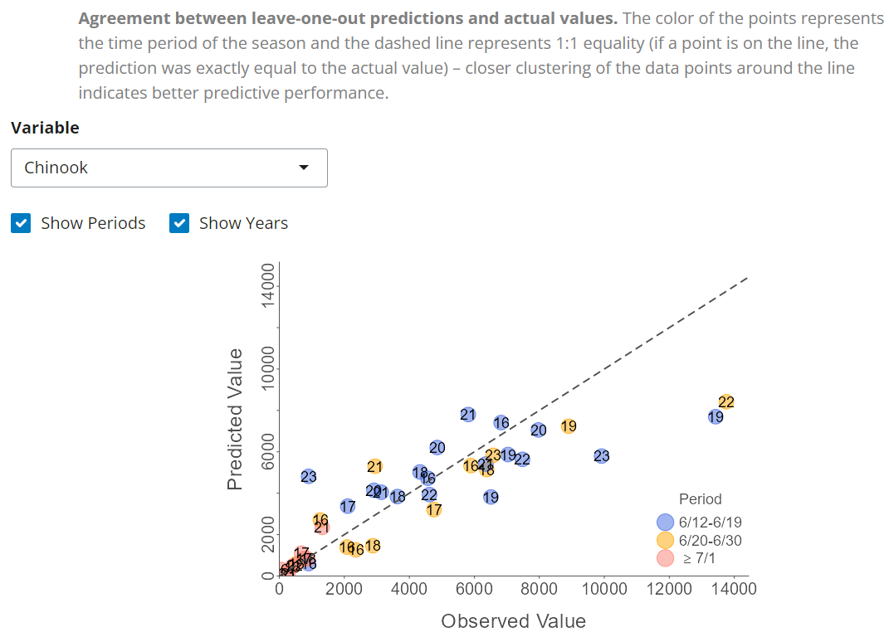
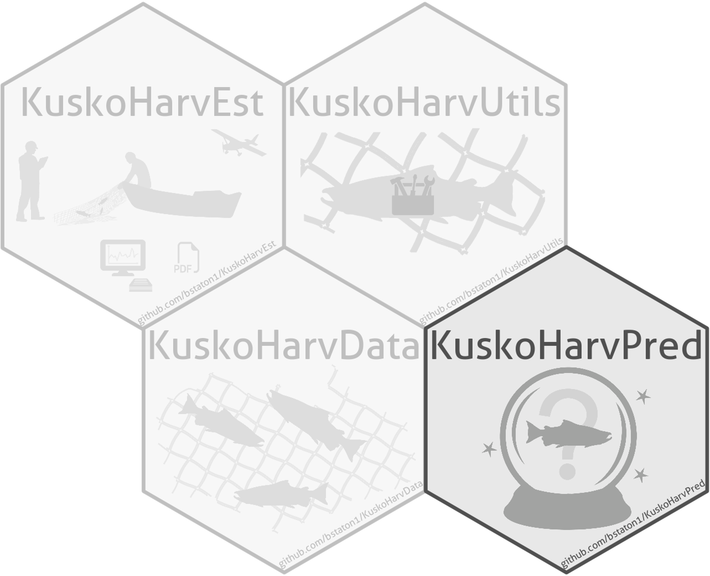

# KuskoHarvPred 

> R package for predicting daily fishery outcomes from openers in the lower Kuskokwim River subsistence salmon fishery.
> Fishery outcomes include drift boat trips/day, salmon catch/trip, and % species composition, and these are treated as response variables in linear regression models with predictions made via AIC-based model-averaging.
> Harvest predictions by species are then obtained by multiplying predictions of the response variables. 
> Leave-one-out cross-validation is used to assess predictive performance.
>
> Importantly, these predictive models and data are made available through a user-friendly interactive web application ("the predictive tool"; [live version online](https://bstaton.shinyapps.io/KuskoHarvPred-tool/)).

## The Predictive Tool

Upon accessing the tool, users will arrive at this page, where they will enter characteristics of the opener they wish to predict fishery outcomes and harvest for: timing and Bethel Test Fishery (a daily fishery-independent index of in-river salmon abundance and species composition).

<p align="center">
  
</p>

Next, users will navigate to the **Outputs** tab to find a table showing predictions of fishery outcomes and harvest by species:

<p align="center">
  
</p>

Those are the steps/tabs required for successful use of the predictive tool -- these values can be used in planning openers for the near-term in-season. 
However, users are encouraged to explore the wealth of additional information available in the tool interface, for example, view how response variables are predicted to vary throughout the season (found in the **Predictive Relationships** tab):

<p align="center">
  
</p>

Or visualize how similar predictions are to the actual values (found in **Statistical Info.** > **Cross-Validation** > **Observed vs. Predicted Plots**): 

<p align="center">
  
</p>

## Accessing the Predictive Tool

The tool can be accessed from [shinyapps.io](https://bstaton.shinyapps.io/KuskoHarvPred-tool/).
However **because of limited server time, if you anticipate using the predictive tool repeatedly, please install the package and run it locally**.
After installing [R](https://cran.rstudio.com/) and [RStudio Desktop](https://posit.co/download/rstudio-desktop/) (accept all defaults when prompted), run this code from the R console:

```R
install.packages("remotes")
remotes::install_github("bstaton1/KuskoHarvPred", build_vignettes = TRUE)
```

After installation, run the predictive tool with:

```R
KuskoHarvPred::run_predictive_tool()
```

## Updating the Predictive Tool

It is the intent of the package developer that the analyses behind the tool be updated with the most current data.
Please see the vignette for instructions about when and how this should be done.

```R
vignette("updating-predictions", package = "KuskoHarvPred")
```

## Related Packages  

'KuskoHarvPred' is a member of a family of packages:

* ['KuskoHarvEst'](https://www.github.com/bstaton1/KuskoHarvEst) contains tools for producing estimates (and PDF reports for distribution) for a single opener.
* ['KuskoHarvData'](https://www.github.com/bstaton1/KuskoHarvData) stores the data and compiled estimates across multiple openers and years.
* ['KuskoHarvUtils'](https://www.github.com/bstaton1/KuskoHarvUtils) contains features that support the other packages.

## Publications

The approach for predicting outcomes of future openers based on past data contained in 'KuskoHarvPred' can be found in the manuscript:

>_In-season predictions of daily harvest for lower Kuskokwim River subsistence salmon fisheries_ by B. A. Staton, W. R. Bechtol, L. G. Coggins Jr., and G. Decossas, submitted to the _North American Journal of Fisheries Management_ (analysis repository: [bstaton1/KuskoHarvPred-ms-analysis](https://www.github.com/bstaton1/KuskoHarvPred-ms-analysis); archived under DOI [10.5281/zenodo.13293677](https://doi.org/10.5281/zenodo.13293677)). 

A description of the sampling methodology and estimation framework can be found in the manuscript:

>_In-season monitoring of harvest and effort from a large-scale subsistence salmon fishery in western Alaska_ by B. A. Staton, W. R. Bechtol, L. G. Coggins Jr., G. Decossas, and J. Esquible, submitted to the _Canadian Journal of Fisheries and Aquatic Sciences_ (analysis repository: [bstaton1/KuskoHarvEst-ms-analysis](https://github.com/bstaton1/KuskoHarvEst-ms-analysis); archived under DOI [10.5281/zenodo.10369148](https://doi.org/10.5281/zenodo.10369148)).

## Contact

Questions or feedback about the predictive framework or tool may be directed to [Ben Staton](https://github.com/bstaton1) (<bstaton.qes@gmail.com>).

## Acknowledgements

'KuskoHarvPred' uses data collected by the Lower Kuskokwim River In-season Subsistence Salmon Harvest Monitoring Program, which is a collaborative effort of the [Kuskokwim River Inter-Tribal Fish Commission](https://www.kuskosalmon.org/), the [Orutsararmiut Native Council](https://orutsararmiut.org/), and the [Yukon Delta National Wildlife Refuge](https://www.fws.gov/refuge/yukon-delta) (U.S. Fish and Wildlife Service).

Several people provided valuable feedback on the statistical framework and interactive tool; in alphabetical order they are: B. Bechtol, L. Coggins, G. Decossas, S. Larson, N. Smith, and J. Spaeder.
The graphic of the crystal ball with a salmon inside in the 'KuskoHarvPred' package logo was created by N. Tamburello.

This package is totally reliant on [RStudio Desktop](https://posit.co/download/rstudio-desktop/), [Rmarkdown](https://rmarkdown.rstudio.com/), and [Shiny](https://shiny.posit.co/) to do its job.
The developers of these free software products are owed gratitude for making the construction of interactive web applications like that contained in 'KuskoHarvPred' possible.

Funding for the development of this package was provided by the [Arctic-Yukon-Kuskokwim Sustainable Salmon Initiative](https://www.aykssi.org/), administered by the [Bering Sea Fisherman's Association](https://www.bsfaak.org/) under project [#AC-2106](https://www.aykssi.org/project/kuskokwim-river-harvest-prediction-tools/).
