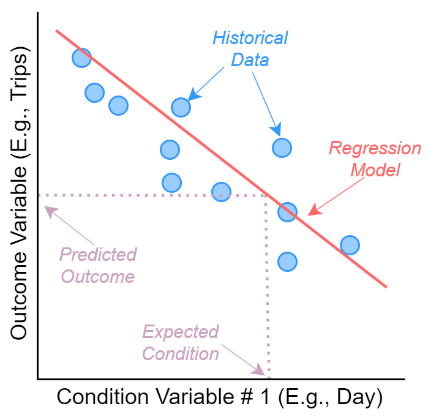
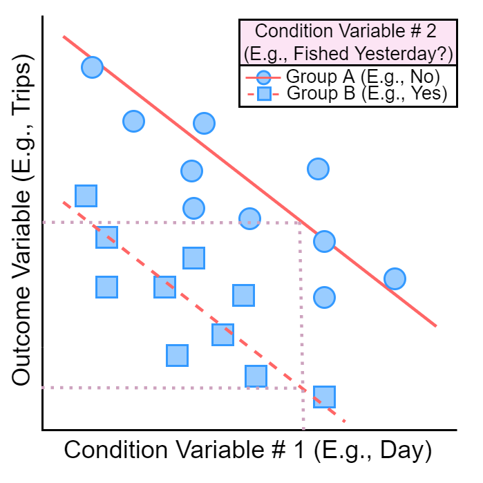

```{r knitr-setup, include = FALSE}
# NOTE FOR FUTURE PUBLICATION INSTANCES TO SHINYAPPS.IO
# THE PACKAGES THAT ARE ON GITHUB **MUST** BE INSTALLED TO THE DEPLOYING COMPUTER
# USING devtools::install_github()
# AND **NOT** devtools::build()
# OTHERWISE RSCONNECT WILL NOT KNOW WHERE TO FIND THESE PACKAGES

knitr::opts_chunk$set(echo = FALSE, fig.align = "center")
```

```{css}
div.blue {
  background-color: #e6f0ff; 
  border-radius: 5px; 
  padding: 5px;
}

div.red {
  background-color: #FFE6E6;
  border-radius: 5px; 
  padding: 5px;
}

figcaption {
  background-color: white;
  color: grey;
  padding: 5px;
  margin-left: 60px;
  margin-right: 60px;
  text-align: left;
}

caption {
  background-color: white;
  color: grey;
  padding: 5px;
  margin-left: 60px;
  margin-right: 60px;
  text-align: left;
}
```

```{r pkg-setup, warning = FALSE, message = FALSE}
# load packages
library(KuskoHarvUtils) # Houses several utility functions that are used across the KuskoHarv* Package Family
library(KuskoHarvEst)   # Houses workflow for producing harvest estimates, and some helper functions used here
library(KuskoHarvData)  # Houses historical data and functions to prepare them for analysis
library(KuskoHarvPred)  # Houses regression infrastructure and output
library(shiny)          # For building interactive elements
library(kableExtra)     # For making HTML Tables
library(lubridate)      # For dealing with dates
library(stringr)        # For dealing with character strings
```

```{r shinyjs-setup, warning = FALSE, message = FALSE}
library(shinyjs)        # For making interactive elements more user-friendly
useShinyjs(rmd = TRUE)
```

```{r data-prep}
# extract the regression data set
fit_data = KuskoHarvPred:::fit_data

# extract the unique years available
yrs = sort(unique(year(fit_data$date)))
```

```{r reactive-container}
rvals = reactiveValues()
```

```{r graphics-parameters-fn}
doc_par = function(
    mar = c(3.5, 3.5, 1, 1),
    mgp = c(1.5, 0.025, 0),
    tcl = 0,
    cex = 1.5,
    cex.axis = 0.9,
    lend = "square", ljoin = "mitre",
    cex.lab = 1.1, col.axis = "grey30", ...) {
  
  do.call(par, c(as.list(environment()), list(...), list(col.lab = col.axis)))
}
```

---

:::{.red}
<details>
  <summary>`r icon("exclamation-triangle")` **Information for New Users**</summary>
  
  `r h5(em("What Does the Tool Do?"))`
  
  <div style="margin-left: 30px;">
  
  This tool is designed to predict outcomes of a single day of fishing in the subsistence salmon fishery in the Lower Kuskokwim River.
  
  The outcomes predicted by the tool are:
  
  *  The number of drift boat trips
  *  The number of salmon (Chinook, chum, and sockeye) caught by the average drift boat trip
  *  The percent of the total salmon catch per trip that is made up of each species (Chinook, chum, and sockeye)
  
  The daily harvest of each species can be predicted from these quantities, which can then inform managers about the likely outcomes of a proposed fishery opportunity based on past data.
  
  </div>
  
  `r h5(em("How Does the Tool Work?"))`
  
  <div style="margin-left: 30px;">
  
  The tool relies on relationships between the outcomes and fishery conditions.
  Fishery conditions might include features like:
  
  *  The time of the season
  *  The time of day or length of fishing period
  *  The abundance and species composition in the river
  
  Please see the `r icon("chart-line")` **Predictive Relationships** tab to view how each outcome has historically varied throughout the season and how the predicted value changes depending on the fishery conditions.
  The `r icon("info-circle")` **Statistical Info.** tab (Methods Overview section) includes more details on how the tool works.
  
  </div>
  
  `r h5(em("How Is the Tool Used?"))`
  
  <div style="margin-left: 5px;">

  1.  Enter the expected conditions of the proposed fishery opportunity (day, start/end times, Bethel Test Fishery index values) on the `r icon("sliders-h")` **Inputs** tab
  2.  Navigate to the `r icon("table")` **Outputs** tab -- the predictions of each outcome and species-specific harvest for the fishing period described in the inputs is shown in two tables.
  3.  To explore how the tool works and to see good its predictions are, see the `r icon("chart-line")` **Predictive Relationships** and `r icon("info-circle")` **Statistical Info.** tabs.
  
  </div>
  
  <div style="margin-left: 30px;">
  
  **NOTE:** On the `r icon("table")` **Outputs** tab, you may manually adjust the predictions if they are very different from the conditions in the current year or your intuition.
  **_Use caution with this feature_** -- it is possible to use this feature to have the tool suggest any possible outcome, so it is essential that good rationale is used when deciding why predictions should be different from those suggested by the model and historical data.
  
  </div>
  
  `r h5(em("Where do the data come from?"))`
  
  <div style="margin-left: 30px;">

  The historical fishery outcomes are informed by data collected collaboratively involving several projects/agencies: Orutsararmiut Native Council, the [Community-Based Harvest Monitoring Program](https://static1.squarespace.com/static/5afdc3d5e74940913f78773d/t/622fc731ca40712f2235eda1/1647298414521/CBHM+2021+Report_final.pdf) (Kuskokwim River Inter-Tribal Fisheries Commission), and the U.S. Fish and Wildlife Service. 
  More information about data collection and harvest/effort estimation can be found in recent reports that document these topics for individual seasons (e.g., [Russell et al. 2021](https://static1.squarespace.com/static/5afdc3d5e74940913f78773d/t/61a6b1098494ce51e26b4460/1638314257230/2021+Kuskokwim+Subsistence+Harvest+Report.pdf); [Staton 2018](https://github.com/bstaton1/KuskoHarvEst/blob/main/inst/rstudio/templates/project/resources/04-documentation/Staton%20-%202018%20-%20In-season%20harvest%20and%20effort%20estimates.pdf)).
  
  Because of the scope of the monitoring data, predictions made by this tool apply only to:
  
  *  Drift nets (no other gears are included)
  *  Mainstem Kuskokwim River (no tributaries are included)
  *  The area between the villages of Tuntutuliak and Akiak
  
  The data informing this tool were collected in June and July in the years `r min(yrs)`-`r max(yrs)` and are made up of `r nrow(fit_data)` individual days of monitored drift fishing.
  
  </div>
  
</details>
:::

---

# {.tabset .tabset-pills}

## `r icon("sliders-h")` Inputs

---

:::{.blue}
<details>
  <summary>`r icon("info-circle")` **Information about `r icon("sliders-h")` Inputs**</summary>
  <br>
  <p style="font-size: 12pt;"><b>On this page, you will enter the conditions of the proposed fishing opportunity.</b></p>
  
  The values entered here will be "plugged in" to historical relationships to predict outcomes for these conditions.
  
  Start by entering the date and the start/end times.
  Be sure to check the box labeled "Fished Previous Day?" if fishing was/will be allowed the day before the date you pick.
  
  Next, enter the expected Bethel Test Fishery daily CPUE for the proposed fishing day.
  If you have no idea, click the button to get the historical average values for the day you selected, or you can easily navigate to the Bethel Test Fishery data webpage by clicking the link.
  
</details>
:::

---

```{r misc}
year = year(today())
default_date = max(as_date(paste0(year, "-06-12")), today() + 3)
min_date = as_date(paste0(year, "-06-12"))
max_date = as_date(paste0(year, "-07-31"))
if (default_date > max_date) default_date = max_date
if (default_date < min_date) default_date = min_date

start_time_bank = c("12:00AM (Start of Day)", paste0(1:11, ":00AM"), paste0(c(12, 1:11), ":00PM"))
end_time_bank = c("12:00AM (Start of Day)", paste0(1:11, ":00AM"), paste0(c(12, 1:11), ":00PM"), "12:00AM (End of Day)")

process_start_date = function(date, time) {
  new_time = str_remove(time, " \\(.+$")
  new_time = str_replace(time, "\\:00", ":00:00 ")
  new_datetime = parse_date_time(paste(date, new_time), '%Y-%m-%d %I:%M:%S %p', tz = "US/Alaska")
  as_datetime(new_datetime, tz = "US/Alaska")
}

process_end_date = function(date, time) {
  if (time == "12:00AM (End of Day)") date = date + 1
  new_time = str_remove(time, " \\(.+$")
  new_time = str_replace(time, "\\:00", ":00:00 ")
  new_datetime = parse_date_time(paste(date, new_time), '%Y-%m-%d %I:%M:%S %p', tz = "US/Alaska")
  as_datetime(new_datetime, tz = "US/Alaska")
}
```

```{r input-widgets}
fillRow(
  height = "80%",
  
  # input widgets for timing info
  column(
    width = 12,
    h3("Opportunity"),
    wellPanel(
      dateInput(inputId = "date", label = "Day of Opportunity",
                       value = default_date, min = min_date, max = max_date, format = "mm-dd-yyyy"),
      selectInput(inputId = "start_time", label = "Start Time", choices = start_time_bank, selected = "10:00AM"),
      selectInput(inputId = "end_time", label = "End Time", choices = end_time_bank, selected = "10:00PM"),
      checkboxInput("fished_yesterday", label = "Fished Previous Day?", value = FALSE)
    )
  ),
  
  # input widgets for BTF info
  column(
    width = 12,
    h3("Bethel Test Fishery"),
    wellPanel(
      numericInput(inputId = "chinook_btf_cpue", label = "Chinook CPUE", value = 10, min = 0),
      numericInput(inputId = "chum_btf_cpue", label = "Chum CPUE", value = 10, min = 0),
      numericInput(inputId = "sockeye_btf_cpue", label = "Sockeye CPUE", value = 10, min = 0),
      a(icon("table"), "View BTF Data Webpage", href = "https://www.adfg.alaska.gov/index.cfm?adfg=commercialbyareakuskokwim.btf"),
      actionButton(inputId = "use_avg_btf", label = paste0("Get 2016-", max(yrs), " Average"), width = "100%")
    )
  )
)

observeEvent(input$start_time, {
  updateSelectInput(
    inputId = "end_time",
    choices = end_time_bank[(which(end_time_bank == input$start_time) + 1):length(end_time_bank)],
    selected = input$end_time)
})

avg_btf_summary = function(dom, moy, stat) {
  dates = as_date(paste(yrs, str_pad(as.character(moy), 2, "left", "0"), str_pad(as.character(dom), 2, "left", "0")))
  round(mean(sapply(dates, KuskoHarvData:::summarize_btf, stat = stat, plus_minus = 1)), 1)
}

observeEvent(input$use_avg_btf, {
  updateNumericInput(inputId = "chinook_btf_cpue", value = avg_btf_summary(day(input$date), month(input$date), "chinook_cpue"))
  updateNumericInput(inputId = "chum_btf_cpue", value = avg_btf_summary(day(input$date), month(input$date), "chum_cpue"))
  updateNumericInput(inputId = "sockeye_btf_cpue", value = avg_btf_summary(day(input$date), month(input$date), "sockeye_cpue"))
})
```

## `r icon("table")` Outputs

---

:::{.blue}
<details>
  <summary>`r icon("info-circle")` **Information about `r icon("table")` Outputs**</summary>
  <br>
  <p style="font-size: 12pt;"><b>This page displays the model-predicted outcomes and harvest based on the input conditions.</b></p>
  
  <p style="font-size: 12pt;"><em>You may also adjust the predictions to align with your expectations.</em></p>
  
  **Model-Predicted Values**
  
  The table shows the predicted values for each outcome variable: drift trips, catch per trip, and species composition.
  The values are obtained using relationships that are shown on the `r icon("chart-line")` **Predictive Relationships** page.
  
  The table also shows the harvest by species implied by the predicted outcomes, and are obtained by multiplying drift trips, catch per trip, and species composition.
  
  **User-Adjusted Predictions**
  
  If you select "Adjust Predictions", you can set the outcome variables to specific values (or ranges of values) to align with what you expect to occur.
  The output you select and the implied predicted harvest will be displayed in the table as well.
  Note that the species composition predictions must add up to 100% -- if you change the value for one species, the other two species will change automatically to ensure this.
  
</details>
:::

---

```{r regression-predictions}
# convert widget inputs to usable formats for regression 
reactive({
  rvals$start_time = process_start_date(input$date, input$start_time)
  rvals$end_time = process_end_date(input$date, input$end_time)
  rvals$hours_open = as.numeric(as.duration(interval(rvals$start_time, rvals$end_time)), units = "hours")
  rvals$hours_before_noon = as.numeric(as.duration(interval(rvals$start_time, as_datetime(paste0(input$date, " 12:00:00"), tz = "US/Alaska"))), units = "hours")
})

# create the complete predictive data set based on widget inputs
reactive({
  rvals$df = data.frame(
    day = KuskoHarvUtils::to_days_past_may31(dates = input$date),
    weekend = wday(input$date, label = TRUE) %in% c("Sat", "Sun"),
    fished_yesterday = input$fished_yesterday,
    hours_open = rvals$hours_open,
    p_before_noon = ifelse(rvals$hours_before_noon < 0, 0, rvals$hours_before_noon/rvals$hours_open),
    total_btf_cpue = input$chinook_btf_cpue + input$chum_btf_cpue + input$sockeye_btf_cpue,
    chinook_btf_comp = input$chinook_btf_cpue/(input$chinook_btf_cpue + input$chum_btf_cpue + input$sockeye_btf_cpue),
    chum_btf_comp = input$chum_btf_cpue/(input$chinook_btf_cpue + input$chum_btf_cpue + input$sockeye_btf_cpue),
    sockeye_btf_comp = input$sockeye_btf_cpue/(input$chinook_btf_cpue + input$chum_btf_cpue + input$sockeye_btf_cpue)
  )
})

# produce regression model predictions
reactive({
  # obtain predicted response variables
  rvals$preds = as.data.frame(lapply(KuskoHarvPred:::fit_lists, function(fit_list) predict_model_avg(fit_list, rvals$df)))
  
  # restandardize composition variables
  rvals$comp_preds = c(chinook = rvals$preds$chinook_comp,  chum = rvals$preds$chum_comp, sockeye = rvals$preds$sockeye_comp)
  rvals$comp_preds_adj = KuskoHarvUtils::smart_round(rvals$comp_preds/sum(rvals$comp_preds), 2)
})
```

```{r user-adjustment-ui}

# allow user to tweak predictions
checkboxInput("show_user_adjust_preds", label = "Adjust Predictions?", value = FALSE)

fillRow(
  flex = c(4,3),
  # table showing output of predictions
  column(
    width = 12,
    h3("Predictions"),
    helpText("Model-predicted outcomes come from the relationships in the ", icon("chart-line"), "Predictive Relationships tab. Harvest predictions come from multiplying ", strong("drift trips"), "by", strong("salmon catch/trip"), "by", strong("species composition"), "."),
    wellPanel(
      renderUI(HTML(rvals$preds_kable))
    )
  ),
  
  # optional sliders to adjust model-predicted values
  hidden(
    div(
      id = "user_adjust_preds",
      column(
        width = 12,
        h3("Adjust Predictions"),
        helpText("If you have reason to believe the outcomes will be different, you can adjust them here to compare with model predictions. The default values are centered on the model prediction, and for drift trips and salmon catch/trip the two endpoints span the range of possible values based on historical variability (+/- 1MAPE)."),
        helpText(strong("NOTE:"), em("This adjustment feature is intended to be used in cases where there is strong rationale for thinking the current year is different than the average year.", strong("Use with caution."))),
        wellPanel(
          sliderInput("user_effort", "Drift Trips", min = 0, max = 1000, value = c(500, 700), step = 10),
          sliderInput("user_total_cpt", "Salmon Catch/Trip", min = 0, max = 100, value = c(10, 20), step = 1),
          sliderInput("user_chinook_comp", "Chinook Composition", min = 0, max = 100, value = 50, post = "%"),
          sliderInput("user_chum_comp", "Chum Composition", min = 0, max = 100, value = 25, post = "%"),
          sliderInput("user_sockeye_comp", "Sockeye Composition", min = 0, max = 100, val = 25, post = "%"),
          actionButton("reset_user", "Reset to Default", icon("sync"))
        )
      )
    )
  )
)

# function to set the values of the user-adjusted sliders
update_user_sliders = function(input, rvals) {
  
  effort_error = KuskoHarvPred:::get_mape("effort", KuskoHarvUtils::get_period(input$date)) * rvals$preds$effort
  total_cpt_error = KuskoHarvPred:::get_mape("total_cpt", KuskoHarvUtils::get_period(input$date)) * rvals$preds$total_cpt
  
  updateSliderInput(inputId = "user_effort", 
                    value = c(max(0, round(rvals$preds$effort - effort_error, -1)), min(1000, round(rvals$preds$effort + effort_error, -1))))
  updateSliderInput(inputId = "user_total_cpt", 
                    value = c(max(0, ceiling(rvals$preds$total_cpt - total_cpt_error)), min(1000, round(rvals$preds$total_cpt + total_cpt_error))))
  updateSliderInput(inputId = "user_chinook_comp", value = unname(rvals$comp_preds_adj["chinook"] * 100))
  updateSliderInput(inputId = "user_chum_comp", value = unname(rvals$comp_preds_adj["chum"] * 100))
  updateSliderInput(inputId = "user_sockeye_comp", value = unname(rvals$comp_preds_adj["sockeye"] * 100))
}

# if predicted values change, reset the sliders
observeEvent(rvals$preds, {
  update_user_sliders(input, rvals)
})

# if the "reset" button is clicked, reset the sliders
observeEvent(input$reset_user, {
  update_user_sliders(input, rvals)
})

# function to calculate the value of two composition sliders when the third is changed
# to ensure they sum to 100%
get_other_percents = function(inputId_changed, inputs) {
  
  # names of all sliders
  all_inputIds = c("user_chinook_comp", "user_chum_comp", "user_sockeye_comp")
  
  # which were not changed
  remaining_inputIds = all_inputIds[-which(all_inputIds == inputId_changed)]
  
  # amount needed to distribute among the unchanged sliders
  remaining = 100 - inputs[[inputId_changed]]
  
  # proportion of the remaining that should be apportioned to each unchanged slider
  # keep ratio of two unchanged sliders the same
  p_remaining_A = inputs[[remaining_inputIds[1]]]/(inputs[[remaining_inputIds[1]]] + inputs[[remaining_inputIds[2]]])
  p_remaining_B = inputs[[remaining_inputIds[2]]]/(inputs[[remaining_inputIds[1]]] + inputs[[remaining_inputIds[2]]])
  
  # create the output vector
  out = remaining * c(p_remaining_A, p_remaining_B)
  names(out) = remaining_inputIds
  out
}

# when the chinook comp is changed, adjust the other two to sum top 100%
observeEvent(input$user_chinook_comp, {
  other_percents = get_other_percents("user_chinook_comp", input)
  updateSliderInput(inputId = "user_chum_comp", value = unname(other_percents["user_chum_comp"]))
  updateSliderInput(inputId = "user_sockeye_comp", value = unname(other_percents["user_sockeye_comp"]))
})

# when the chum comp is changed, adjust the other two to sum top 100%
observeEvent(input$user_chum_comp, {
  other_percents = get_other_percents("user_chum_comp", input)
  updateSliderInput(inputId = "user_chinook_comp", value = unname(other_percents["user_chinook_comp"]))
  updateSliderInput(inputId = "user_sockeye_comp", value = unname(other_percents["user_sockeye_comp"]))
})

# when the sockeye comp is changed, adjust the other two to sum top 100%
observeEvent(input$user_sockeye_comp, {
  other_percents = get_other_percents("user_sockeye_comp", input)
  updateSliderInput(inputId = "user_chinook_comp", value = unname(other_percents["user_chinook_comp"]))
  updateSliderInput(inputId = "user_chum_comp", value = unname(other_percents["user_chum_comp"]))
})

# remove the user adjustment UI if checkbox is not checked
observe({
  toggle(id = "user_adjust_preds", condition = input$show_user_adjust_preds)
})
```

```{r preds-kable}

# function to create output table
preds_kable = function(input, rvals) {
  
  # process regression model predictions: always displayed
  model_effort = round(rvals$preds$effort)
  model_total_cpt = ceiling(rvals$preds$total_cpt)
  model_chinook_comp = rvals$comp_preds_adj["chinook"]
  model_chum_comp = rvals$comp_preds_adj["chum"]
  model_sockeye_comp = rvals$comp_preds_adj["sockeye"]
  model_total_harv = model_effort * model_total_cpt
  model_chinook_harv = round(model_total_harv * model_chinook_comp, -1)
  model_chum_harv = round(model_total_harv * model_chum_comp, -1)
  model_sockeye_harv = round(model_total_harv * model_sockeye_comp, -1)
  model_total_harv = model_chinook_harv + model_chum_harv + model_sockeye_harv
  
  # combine individual quantities into nice formatted data frame for easy kable
  model_preds = data.frame(
    quantity = c("Drift Trips", "Salmon Catch/Trip", "Chinook Composition", "Chum Composition", "Sockeye Composition", "Chinook Harvest", "Chum Harvest", "Sockeye Harvest", "Total Harvest"),
    model = c(prettyNum(model_effort, big.mark = ",", scientific = FALSE), model_total_cpt, KuskoHarvUtils::percentize(c(model_chinook_comp, model_chum_comp, model_sockeye_comp)), prettyNum(c(model_chinook_harv, model_chum_harv, model_sockeye_harv, model_total_harv), big.mark = ",", scientific = FALSE))
  )
  
  # if allowing user-adjusted predictions
  if (input$show_user_adjust_preds) {
    
    # obtain user-adjusted predictions
    user_effort = round(input$user_effort)
    user_total_cpt = ceiling(input$user_total_cpt)
    user_chinook_comp = input$user_chinook_comp/100
    user_chum_comp = input$user_chum_comp/100
    user_sockeye_comp = input$user_sockeye_comp/100
    user_total_harv = user_effort * user_total_cpt
    user_chinook_harv = round(user_total_harv * user_chinook_comp, -1)
    user_chum_harv = round(user_total_harv * user_chum_comp, -1)
    user_sockeye_harv = round(user_total_harv * user_sockeye_comp, -1)
    user_total_harv = user_chinook_harv + user_chum_harv + user_sockeye_harv
    
    user_effort[3] = round(mean(user_effort))
    user_total_cpt[3] = round(mean(user_total_cpt))
    user_chinook_harv[3] = round(mean(user_chinook_harv), -1)
    user_chum_harv[3] = round(mean(user_chum_harv), -1)
    user_sockeye_harv[3] = round(mean(user_sockeye_harv), -1)
    user_total_harv[3] = round(mean(user_total_harv), -1)
    # make into a nice data frame
    user_preds = data.frame(
      quantity = c("Drift Trips", "Salmon Catch/Trip", "Chinook Composition", "Chum Composition", "Sockeye Composition", "Chinook Harvest", "Chum Harvest", "Sockeye Harvest", "Total Harvest"),
      user_lwr = c(prettyNum(user_effort[1], big.mark = ",", scientific = FALSE), user_total_cpt[1], KuskoHarvUtils::percentize(c(user_chinook_comp, user_chum_comp, user_sockeye_comp)), prettyNum(c(user_chinook_harv[1], user_chum_harv[1], user_sockeye_harv[1], user_total_harv[1]), big.mark = ",", scientific = FALSE)),
      
      user_mid = c(prettyNum(user_effort[3], big.mark = ",", scientific = FALSE), user_total_cpt[3], KuskoHarvUtils::percentize(c(user_chinook_comp, user_chum_comp, user_sockeye_comp)), prettyNum(c(user_chinook_harv[3], user_chum_harv[3], user_sockeye_harv[3], user_total_harv[3]), big.mark = ",", scientific = FALSE)),
      
      user_upr = c(prettyNum(user_effort[2], big.mark = ",", scientific = FALSE), user_total_cpt[2], KuskoHarvUtils::percentize(c(user_chinook_comp, user_chum_comp, user_sockeye_comp)), prettyNum(c(user_chinook_harv[2], user_chum_harv[2], user_sockeye_harv[2], user_total_harv[2]), big.mark = ",", scientific = FALSE))
    )
    
    # combine with the regression predictions
    preds = merge(model_preds, user_preds, by = "quantity", sort = FALSE)
    col_names = c(" ", "Model", "User Min.", "User Mid.", "User Max.")
    align = "lcccc"
    header = c(" " = 1, "Predicted Values" = 4)
  } else {
    preds = model_preds
    col_names = c(" ", "Model")
    align = "lc"
    header = c(" " = 1, "Predicted Values" = 1)
  }
  
  kbl(preds, "html", col.names = col_names, align = align) |>
    kable_styling(full_width = FALSE, bootstrap_options = c("condensed")) |>
    column_spec(1, bold = FALSE, italic = TRUE) |>
    pack_rows("Predicted Outcomes", 1, 5) |>
    pack_rows("Predicted Harvest", 6, 9, hline_before = TRUE) |>
    add_header_above(header)
    
}

# create the table
reactive({
  rvals$preds_kable = preds_kable(input, rvals)
})

```

## `r icon("chart-line")` Predictive Relationships {#section-relationships-tab}

---

:::{.blue}
<details>
  <summary>`r icon("info-circle")` **Information about `r icon("chart-line")` Predictive Relationships**</summary>
  <br>
  <p style="font-size: 12pt;"><b>This page displays the relationships between historical outcomes and conditions.</b></p>
  
  In the figure displayed on this page, 
  
  *  The vertical axis is the value of the outcome variable
  *  The horizontal axis is the day of the season
  *  Blue points represent historical data
  *  Red lines represent model predicted values
  
  The figure shows how the value of different outcome variables change throughout the season.
  Additionally, you can see how changes in the other condition variables impact the predicted value from the model by selecting different options for the other condition variables.
  
  If you check "Show Uncertainty", a region around the model predicted value will be displayed -- this represents +/- 1 mean absolute % error, obtained using leave-one-out cross-validation and is the area we would expect outcomes to occur due to random variability that the model cannot predict (see `r icon("info-circle")` Statistical Info. > Cross-Validation for more information).
  
  Not all condition variables are used to predict all outcome variables.
  For example, "hours of fishing" is a condition variable that is used to predict drift trips/day and salmon catch/day, but not the species composition outcome variables.
  This is why "hours of fishing" disappears when viewing the species composition relationships.
  
</details>
:::

```{r plot-ui}

CAT_btf_choices = c("Maximum" = "max", "Average" = "mean", "Minimum" = "min")
response_choices = c("Drift Trips/Day" = "effort", "Salmon Catch/Trip" = "total_cpt", "Chinook Composition" = "chinook_comp", "Chum Composition" = "chum_comp", "Sockeye Composition" = "sockeye_comp")
hr()
selectInput(inputId = "plot_response", label = p("Outcome Variable", style = "font-size: 15pt;"), choices = response_choices, width = "25%")
checkboxInput("draw_mape_range", "Show Uncertainty", value = FALSE)
hr()

p(strong("Condition Variables"), style = "font-size: 15pt;")
fillRow(
  column(
    width = 12,
    hidden(
      selectInput(inputId = "plot_CAT_total_btf_cpue", label = "Total BTF CPUE", choices = CAT_btf_choices, selected = "mean")
    ),
    
    hidden(
      selectInput(inputId = "plot_CAT_chinook_btf_comp", label = "Chinook BTF Composition", choices = CAT_btf_choices, selected = "mean")
    ),
    
    hidden(
      selectInput(inputId = "plot_CAT_chum_btf_comp", label = "Chum BTF Composition", choices = CAT_btf_choices, selected = "mean")
    ),
    
    hidden(
      selectInput(inputId = "plot_CAT_sockeye_btf_comp", label = "Sockeye BTF Composition", choices = CAT_btf_choices, selected = "mean")
    )
  ),
  
  column(
    width = 12,
    hidden(
      selectInput(inputId = "plot_hours_open", label = "Hours of Fishing", choices = c("6", "12", "18", "24"), selected = "12")
    ),
    
    hidden(
      selectInput(inputId = "plot_p_before_noon", label = "Percent of Fishing Before Noon", choices = c("0%" = "0", "25%" = "0.25", "50%" = "0.50", "75%" = "0.75", "100%" = 1), selected = "0.25")
    )
  )
)
hr()
```

```{r plot-server}
# Extract all predictor variable names for this response variable
reactive({
  rvals$vars = KuskoHarvPred:::find_variables(KuskoHarvPred:::fit_lists[[input$plot_response]])
})

# Toggle the various plot settings widgets based on whether that covariate is in any models for that response variable
observe({
  toggle(id = "plot_hours_open", condition = "hours_open" %in% rvals$vars)
  toggle(id = "plot_p_before_noon", condition = "p_before_noon" %in% rvals$vars)
  toggle(id = "plot_CAT_total_btf_cpue", condition = "total_btf_cpue" %in% rvals$vars)
  toggle(id = "plot_CAT_chinook_btf_comp", condition = "chinook_btf_comp" %in% rvals$vars)
  toggle(id = "plot_CAT_chum_btf_comp", condition = "chum_btf_comp" %in% rvals$vars)
  toggle(id = "plot_CAT_sockeye_btf_comp", condition = "sockeye_btf_comp" %in% rvals$vars)
})

# Construct the settings for subsetting pre-processed predictions for plotting
reactive({
  rvals$plot_settings = list(
    hours_open = as.numeric(input$plot_hours_open),
    p_before_noon = as.numeric(input$plot_p_before_noon),
    CAT_total_btf_cpue = input$plot_CAT_total_btf_cpue,
    CAT_chinook_btf_comp = input$plot_CAT_chinook_btf_comp,
    CAT_chum_btf_comp = input$plot_CAT_chum_btf_comp,
    CAT_sockeye_btf_comp = input$plot_CAT_sockeye_btf_comp,
    CAT_mean_Nwind = input$plot_CAT_mean_Nwind,
    CAT_mean_Ewind = input$plot_CAT_mean_Ewind
  )
})
```

```{r plot-output}
# plot the relationship between the response variable and day of the season
# settings argument is a list that says which prediction covariates to keep and display
# e.g., default is to plot with mean BTF values, but could supply "min" or "max" to see how this changes predicted curve
br()
br()
br()
br()
br()
br()

div(
  style = "margin: auto; width: 60%",
  renderPlot(expr = {
    doc_par()
    relationship_plot(response = input$plot_response,
           settings = rvals$plot_settings,
           dat = fit_data,
           separate_day_types = TRUE,
           # pred_day = KuskoHarvUtils::to_days_past_may31(input$date),
           # pred_response = rvals$preds[,input$plot_response]
           pred_day = NULL,
           pred_response = NULL, 
           draw_mape_range = input$draw_mape_range
           )
    # abline(v = c(20, 31))
  })
)
```

## `r icon("search")` Data Explorer {.tabset}

---

:::{.blue}
<details>
  <summary>`r icon("info-circle")` **Information about `r icon("search")` Data Explorer**</summary>
  <br>
  <p style="font-size: 12pt;"><b>This page displays the data used by the predictive relationships.</b></p>
  
  **Outcome Data**
  
  This tab shows the outcomes and harvest from each day of monitored drift boat fishing.
  Each row is one day, and you can filter rows by specific values by clicking the `r icon("filter")` "Show/Hide Filters" link.
  
  **Condition Data**
  
  This tab shows the conditions used to predict outcomes from each day of monitored drift boat fishing.
  Each row is one day, and you can filter rows by specific values by clicking the `r icon("filter")` "Show/Hide Filters" link.
  
</details>
:::

---

### Outcome Data

```{r outcome-data-UI}
# link to show/hide data filters UI
actionLink("show_hide_resp_kable_filters", label = "Show/Hide Filters", icon = icon("filter"))

# UI elements for filtering the outcome data
hidden(
  div(
    id = "resp_kable_filters",
    fillRow(
      flex = c(1,1),
      
      # Filter by time period
      column(
        width = 12,
        h3(icon("filter"), "Time Periods"),
        wellPanel(
          selectizeInput("resp_kable_years", "Years", choices = yrs, selected = yrs, multiple = TRUE,
                         options = list(placeholder = "Select one or more years",
                                        plugins = list("remove_button"))),
          selectizeInput("resp_kable_periods", "Periods",
                         choices = list("Period 1 (6/12-6/19)" = 1, "Period 2 (6/20-6/30)" = 2, "Period 3 (7/1-7/31)" = 3),
                         selected = c(1,2,3), multiple = TRUE,
                         options = list(placeholder = "Select one or more periods", plugins = list("remove_button"))),
          actionButton("filter_resp_periods_select_all", "Select All", width = "100%", icon = icon("check"))
        )
      ),
      
      # Filter by outcome
      column(
        width = 12,
        h3(icon("filter"), "Outcomes"),
        wellPanel(
          # splitLayout(
            sliderInput("resp_kable_effort", "Drift Trips", min = min(fit_data$effort), max = max(fit_data$effort),
                        value = range(fit_data$effort), width = "95%"),
            sliderInput("resp_kable_total_cpt", "Catch/Trip", min = min(round(fit_data$total_cpt)), max = max(round(fit_data$total_cpt)),
                        value = range(round(fit_data$total_cpt)), width = "95%"),
            sliderInput("resp_kable_chinook_comp", "Chinook Composition", min = min(round(fit_data$chinook_comp, 2)) * 100, max = max(round(fit_data$chinook_comp, 2)) * 100,
                        value = range(round(fit_data$chinook_comp, 2) * 100), post = "%", width = "95%"),
          # ),
          actionButton("filter_outcomes_select_all", "Select All", width = "100%", icon = icon("check"))
        )
      )
    ),
    
    # empty space between filters and the table
    # FIXME: work out a better solution for this kind of thing
    br(),
    br(),
    br(),
    br(),
    br(),
    br(),
    br(),
    br(),
    br(),
    br(),
    br(),
    br(),
    br(),
    br(),
    br(),
    br(),
    br(),
    br(),
    br(),
    br(),
    br(),
    br()
  )
)

# show or hide filters when the action link is clicked
observeEvent(input$show_hide_resp_kable_filters, {
  toggle(id = "resp_kable_filters")
})

# reset the time period filters to default when action button is clicked
observeEvent(input$filter_resp_periods_select_all, {
  updateSelectizeInput(inputId = "resp_kable_years", selected = yrs)
  updateSelectizeInput(inputId = "resp_kable_periods", selected = c(1,2,3))
})

# reset the outcome filters to default when action button is clicked
observeEvent(input$filter_outcomes_select_all, {
  updateSliderInput(inputId = "resp_kable_effort", value = range(fit_data$effort))
  updateSliderInput(inputId = "resp_kable_total_cpt", value = range(round(fit_data$total_cpt)))
  updateSliderInput(inputId = "resp_kable_chinook_comp", value = range(round(fit_data$chinook_comp, 2) * 100))
})

```

```{r outcome-data-fn}
resp_kable = function(period_keep, year_keep, effort_range, total_cpt_range, chinook_comp_range) {
  table_dat = prepare_regression_data()
  data("meta", package = "KuskoHarvData")
  meta$date = lubridate::date(meta$start)
  table_dat = merge(meta, table_dat, by = "date", sort = FALSE, all.y = TRUE, all.x = FALSE)
  
  
  table_dat$total_cpt = round(table_dat$total_cpt)
  table_dat = cbind(year = as.character(year(table_dat$date)), table_dat)
  table_dat$chinook_comp = round(table_dat$chinook_comp, 2)
  table_dat$chum_comp = round(table_dat$chum_comp, 2)
  table_dat$sockeye_comp = round(table_dat$sockeye_comp, 2)
  
  effort_in = table_dat$effort >= effort_range[1] & table_dat$effort <= effort_range[2]
  total_cpt_in = table_dat$total_cpt >= total_cpt_range[1] & table_dat$total_cpt <= total_cpt_range[2]
  chinook_comp_in = table_dat$chinook_comp >= chinook_comp_range[1] & table_dat$chinook_comp <= chinook_comp_range[2]

  table_dat = table_dat[table_dat$period %in% period_keep & table_dat$year %in% year_keep & effort_in & total_cpt_in & chinook_comp_in,]
  
  table_dat$start_time = KuskoHarvUtils::short_datetime(table_dat$start)
  table_dat$end_time = KuskoHarvUtils::short_datetime(table_dat$end)
  table_dat = table_dat[,c("year", "period", "date", "start_time", "end_time", "effort", "total_cpt", "chinook_comp", "chum_comp", "sockeye_comp", "chinook_harv", "chum_harv", "sockeye_harv")]
  table_dat$chinook_comp = KuskoHarvUtils::percentize(table_dat$chinook_comp)
  table_dat$chum_comp = KuskoHarvUtils::percentize(table_dat$chum_comp)
  table_dat$sockeye_comp = KuskoHarvUtils::percentize(table_dat$sockeye_comp)

  table_dat$chinook_harv = round(table_dat$chinook_harv, -1)
  table_dat$chum_harv = round(table_dat$chum_harv, -1)
  table_dat$sockeye_harv = round(table_dat$sockeye_harv, -1)
  table_dat = cbind(table_dat, "total_harv" = table_dat$chinook_harv + table_dat$chum_harv + table_dat$sockeye_harv)
  table_dat$date = paste(lubridate::month(table_dat$date, label = TRUE, abbr = TRUE), lubridate::day(table_dat$date))
  
  
  if (nrow(table_dat) > 0) {
    out = table_dat |>
      kbl("html", row.names = FALSE,
          col.names = c("Year", "Period", "Date", "Start Time", "End Time", "Drift Trips", "Catch/Trip", rep(c("Chinook", "Chum", "Sockeye"), 2), "Total"),
          align = "cclllccccccccc", format.args = list(big.mark = ",")) |>
      kable_styling(full_width = TRUE, bootstrap_options = c("condensed"), fixed_thead = TRUE) |>
      collapse_rows(1:2) |>
      add_header_above(c(" " = 7, "Species Composition" = 3, "Harvest" = "4"))
    
  } else {
    out = '<p align="center" style="color:tomato; font-size:150%;">No records match the selected filters.</p>'
  }
  
  return(out)
}
```

```{r outcome-data-output}
# create the table contents
reactive({
  rvals$resp_kable = resp_kable(period_keep = input$resp_kable_periods, year_keep = input$resp_kable_years,
                                effort_range = input$resp_kable_effort,
                                total_cpt_range = input$resp_kable_total_cpt,
                                chinook_comp_range = input$resp_kable_chinook_comp/100
  )
})

# render table
renderUI(HTML(rvals$resp_kable))

# update the action link text with how many records out of the total are displayed
# any time the contents of the table change
observeEvent(rvals$resp_kable, {
  nrows_resp_kable = max(stringr::str_count(as.character(rvals$resp_kable), "<tr>") - 2, 0)
  updateActionLink(inputId = "show_hide_resp_kable_filters", label = paste0("Show/Hide Filters (", nrows_resp_kable, "/", nrow(fit_data), " records shown)"))
})
```

### Condition Data

```{r condition-data-UI}
# link to show/hide data filters UI
actionLink("show_hide_pred_kable_filters", label = "Show/Hide Filters", icon = icon("filter"))

# UI elements for filtering the outcome data
hidden(
  div(
    id = "pred_kable_filters",
    fillRow(
      flex = c(1,3),
      
      # Filter by time period
      column(
        width = 12,
        h3(icon("filter"), "Time Periods"),
        wellPanel(
          selectizeInput("pred_kable_years", "Years", choices = yrs, selected = yrs, multiple = TRUE,
                         options = list(placeholder = "Select one or more years",
                                        plugins = list("remove_button"))),
          selectizeInput("pred_kable_periods", "Periods",
                         choices = list("Period 1 (6/12-6/19)" = 1, "Period 2 (6/20-6/30)" = 2, "Period 3 (7/1-7/31)" = 3),
                         selected = c(1,2,3), multiple = TRUE,
                         options = list(placeholder = "Select one or more periods",
                                        plugins = list("remove_button"))),
          actionButton("filter_pred_periods_select_all", "Select All", icon = icon("check"), width = "100%")
        )
      )
    ),
    
    # empty space between filters and the table
    # FIXME: work out a better solution for this kind of thing
    br(),
    br(),
    br(),
    br(),
    br(),
    br(),
    br(),
    br(),
    br(),
    br(),
    br(),
    br(),
    br(),
    br(),
    br()
  )
)

# show or hide filters when the action link is clicked
observeEvent(input$show_hide_pred_kable_filters, {
  toggle(id = "pred_kable_filters")
})

# reset the time period filters to default when action button is clicked
observeEvent(input$filter_pred_periods_select_all, {
  updateSelectizeInput(inputId = "pred_kable_years", selected = yrs)
  updateSelectizeInput(inputId = "pred_kable_periods", selected = c(1,2,3))
})
```

```{r condition-data-fn}
pred_kable = function(period_keep, year_keep) {
  table_dat = prepare_regression_data()
  data("meta", package = "KuskoHarvData")
  meta$date = lubridate::date(meta$start)
  table_dat = merge(meta, table_dat, by = "date", sort = FALSE, all.y = TRUE, all.x = FALSE)
  
  # keep only the relevant records
  table_dat = table_dat[table_dat$period %in% period_keep & table_dat$year %in% year_keep,]
  
  # find the variables used in any model
  # pred_vars = unique(unlist(lapply(fit_lists, KuskoHarvPred:::find_variables)))
  # pred_vars = pred_vars[!stringr::str_detect(pred_vars, "^I\\(")]
  ordered_pred_vars = c("hours_open", "p_before_noon", 
                        "weekend", "fished_yesterday", "total_btf_cpue",
                        "chinook_btf_comp", "chum_btf_comp", "sockeye_btf_comp"
                        # "mean_Nwind", "mean_Ewind"
                        )
  
  # check to make sure everything is included
  # all(pred_vars %in% ordered_pred_vars)
  
  # keep only variables to display
  table_dat = table_dat[,c("year", "period", "date", ordered_pred_vars)]
  
  # convert proportion variables to percentages
  table_dat$p_before_noon = KuskoHarvUtils::percentize(table_dat$p_before_noon)
  table_dat$chinook_btf_comp = KuskoHarvUtils::percentize(table_dat$chinook_btf_comp)
  table_dat$chum_btf_comp = KuskoHarvUtils::percentize(table_dat$chum_btf_comp)
  table_dat$sockeye_btf_comp = KuskoHarvUtils::percentize(table_dat$sockeye_btf_comp)
  
  # convert logical variables to yes/no
  table_dat$weekend = ifelse(table_dat$weekend, "Yes", "No")
  table_dat$fished_yesterday = ifelse(table_dat$fished_yesterday, "Yes", "No")
  
  # round numeric variables
  table_dat$total_btf_cpue = round(table_dat$total_btf_cpue)
  
  # format the date
  table_dat$date = paste(lubridate::month(table_dat$date, label = TRUE, abbr = TRUE), lubridate::day(table_dat$date))
  
  # create the output: a nice kable if some records available, a nice message if not
  if (nrow(table_dat) > 0) {
    out = table_dat |>
      kbl("html", row.names = FALSE,
          col.names = c("Year", "Period", "Date",
                        "Hours Open", "%Before Noon", "Weekend?", "Fished Yesterday?",
                        "Total CPUE", "%Chinook", "%Chum", "%Sockeye"
                        ),
          align = "cclcccccccc") |>
      kable_styling(full_width = TRUE, bootstrap_options = c("condensed"), fixed_thead = TRUE) |>
      collapse_rows(1:2) |>
      column_spec(3, width = "65px") |>
      add_header_above(c(" " = 7, "Bethel Test Fishery" = 4
                         ))
    
  } else {
    out = '<p align="center" style="color:tomato; font-size:150%;">No records match the selected filters.</p>'
  }
  
  return(out)
}
```

```{r condition-data-output}
# create the table contents
reactive({
  rvals$pred_kable = pred_kable(period_keep = input$pred_kable_periods, year_keep = input$pred_kable_years)
})

# render table
renderUI(HTML(rvals$pred_kable))

# update the action link text with how many records out of the total are displayed
# any time the contents of the table change
observeEvent(rvals$pred_kable, {
  nrows_pred_kable = max(stringr::str_count(as.character(rvals$pred_kable), "<tr>") - 2, 0)
  updateActionLink(inputId = "show_hide_pred_kable_filters", label = paste0("Show/Hide Filters (", nrows_pred_kable, "/", nrow(fit_data), " records shown)"))
})
```

### Scatterplots

```{r scatterplots-ui}
resp_vars = c("effort", "total_cpt", "chinook_comp", "chum_comp", "sockeye_comp")
pred_vars = c("day", "hours_open", "p_before_noon", "weekend", "fished_yesterday", "total_btf_cpue", "chinook_btf_comp", "chum_btf_comp", "sockeye_btf_comp")
names(resp_vars) = sapply(resp_vars, function(v) KuskoHarvPred:::get_var_name(v))
names(pred_vars) = sapply(pred_vars, function(v) KuskoHarvPred:::get_var_name(v))

selectInput("scatterplot_xvar", label = "X-Axis Variable", choices = list("Outcome Variables" = resp_vars, "Condition Variables" = pred_vars), selected = "total_btf_cpue")
selectInput("scatterplot_yvar", label = "Y-Axis Variable", choices = list("Outcome Variables" = resp_vars, "Condition Variables" = pred_vars), selected = "total_cpt")
checkboxInput("scatterplot_color_periods", label = "Show Periods", value = FALSE)
checkboxInput("scatterplot_label_years", label = "Show Years", value = FALSE)
```

```{r scatterplots-output}
div(
  style = "margin: auto; width: 60%",
  renderPlot(expr = {
    doc_par()
    vars_biplot(
      xvar = input$scatterplot_xvar,
      yvar = input$scatterplot_yvar,
      dat = fit_data,
      color_periods = input$scatterplot_color_periods,
      label_years = input$scatterplot_label_years
    )
  })
)
```

## `r icon("info-circle")` Statistical Info. {.tabset}

### Methods Overview {#section-methods-overview}

#### Summary

:::{.p style="margin-left: 30px;"}

**Goal**: Obtain accurate predictions of harvest by species for a proposed fishing opportunity.

**Overall Approach**: Use historical outcomes and conditions to develop relationships, then use them to obtain predictions of outcomes based on the expected conditions for the current year.

**Statistical Approach**: Quantify relationships using several linear regression models for each outcome variable.
Perform AIC model-averaging with the models that make up the top 75% of model weight to obtain predictions that account for model uncertainty.
Predictive performance of models was assessed using leave-one-out cross-validation.
:::

#### Outcome Variables that Determine Harvest

:::{.p style="margin-left: 30px;"}

Daily harvest of a given species is the product of the values of three outcome variables:

$$
\mathrm{Harvest_{species} = number\space of\space trips \times total\space salmon\space catch\space per\space trip \times \%Composition_{species}}
$$

Rather than predict harvest directly, the tool predicts each of the three outcome variables, which are then multiplied to obtain predictions of harvest.
This is because the three outcome variables may vary in more predictable ways than total harvest does.
:::

#### Relationships and Prediction

:::{.p style="margin-left: 30px;"}

The outcome variables vary in somewhat predictable ways throughout the season.
For example, the number of total drift trips generally decreases throughout the season, as does the percent composition of Chinook salmon in the catch.
So we could consider "day of the season" a condition variable that may be useful for predicting the values of these outcomes.

The statistical analysis behind this tool uses **linear regression** modeling to build relationships between outcome variables and condition variables.
Take the figure below as an example: the outcome variable decreases on average with increasing values of the condition variable. 
The red line is the model -- it estimates the average value of the outcome at a given condition value.
Once we have the relationship

<figure align="center">
  
  <figcaption>
    Hypothetical relationship between an outcome variable and a condition variable.
    The grey dotted lines show how the relationship is used to make a prediction.
  </figcaption>
</figure>

In addition, we may have reason to believe that outcome variables are influenced by more than one condition variables, such as the in-river salmon abundance or the weather.
We can build models that account for more than one condition variable at a time; consider the example below where in addition to condition variable #1, there is also a condition variable #2 which categorizes the data into two groups: A and B.
In this case, the model will produce a different prediction for the same value of condition variable #1 depending on the value of condition variable #2.

<figure align="center">
  
  <figcaption>
    Hypothetical relationship between an outcome variable and two condition variables: one numerical and one categorical.
    The grey dotted lines show that there are two model predictions at a given value of condition #1: one that applies when condition variable #2 is group A and one for when condition variable #2 is group B. 
  </figcaption>
</figure>

:::

#### Condition Variables

:::{.p style="margin-left: 30px;"}

Care must be used when selecting which condition variables to assess for predicting outcomes.
Condition variables must be measurable and available in the past and future.
Importantly, they should have a plausible mechanism for causing the outcome variable to vary.

The table below shows which condition variables were included as part of the analysis.
Notice that not all condition variables were assessed as predictors for all outcomes, and that not all assessed variables made it into the final analysis because they had little-to-no predictive utility.

<details>
<summary>Click to view table</summary>

```{r predictor-vars-table}
tab = c(
# Variable               Description                                                      EFFORT CPT    %CHIN  %CHUM  %SOCK  
  "Day",                 "Number of days past May 31st",                                  "YES", "YES", "YES", "YES", "YES",
  "Day^2",               "Quadratic form; allows non-linear time trends",                 "NO" , "YES", "NO" , "NO" , "NO" ,
  "Hours Open",          "Number of hours fishing was allowed that day",                  "YES", "NO" , "NO" , "NO" , "NO" ,
  "Fished Yesterday",    "Yes/No; whether fishing was allowed the previous day",          "YES", "YES", "NO" , "NO" , "NO" ,
  "Weekend",             "Yes/No; whether the day was Saturday or Sunday",                "YES", "NO" , "NO" , "NO" , "NO" ,
  "% Before Noon",       "Proportion of fishing hours that occured before noon that day", "YES", "NO" , "NO" , "NO" , "NO" ,
  "BTF CPUE",            "Total daily Bethel Test Fishery CPUE (Chinook+chum+sockeye)",   "YES", "YES", "NO" , "NO" , "NO" ,
  "BTF % Chinook",       "Daily proportion that Chinook CPUE made up of the total",       "YES", "NO" , "YES", "NO" , "NO" ,
  "BTF % Chum",          "Daily proportion that chum CPUE made up of the total",          "NO" , "NO" , "NO" , "YES", "NO" ,
  "BTF % Sockeye",       "Daily proportion that sockeye CPUE made up of the total",       "NO" , "NO" , "NO" , "NO" , "YES",
  "Air Temperature",     "Daily average air temperature",                                 "TRY", "NO" , "NO" , "NO" , "NO" ,
  "Relative Humidity",   "Daily average percent relative humidity",                       "TRY", "NO" , "NO" , "NO" , "NO" ,
  "Precipitation",       "Daily total precipitation",                                     "TRY", "NO" , "NO" , "NO" , "NO" ,
  "Wind Speed",          "Daily average wind speed",                                      "TRY", "TRY", "NO" , "NO" , "NO" ,
  "Gust Wind Speed",     "Daily maximum gust speed",                                      "TRY", "TRY", "NO" , "NO" , "NO" ,
  "Northerly Wind Speed","Daily average northerly wind speed vector",                     "TRY", "TRY", "NO" , "NO" , "NO" ,
  "Easterly Wind Speed", "Daily average easterly wind speed vector",                      "TRY", "TRY", "NO" , "NO" , "NO" ,
  "Water Clarity",       "Daily index of water clarity",                                  "NO" , "TRY", "NO" , "NO" , "NO" ,
  "Water Temperature",   "Daily water temperature",                                       "NO" , "TRY", "NO" , "NO" , "NO" 
)

tab = matrix(tab, ncol = 7, byrow = TRUE)

tab[tab == "YES"] = "&#9745;"
tab[tab == "NO"] = "&#9744;"
tab[tab == "TRY"] = "&#9746;"

tab[,3:7] = cell_spec(tab[,3:7], "html", font_size = "x-large", escape = FALSE)

type = c(rep("Timing", 6), rep("Bethel Test Fishery", 4), rep("Weather<sup>1<\\sup>", 7), rep("Water<sup>2<\\sup>", 2))

tab = cbind(type, tab)

kbl(tab, col.names = c(" ", "Condition Variable", "Description", "Trips/Day", "Catch/Trip", "Chinook", "Chum", "Sockeye"), escape = FALSE, align = "lllccccc",
    caption = 'All condition variables assessed as part of the predictive analyses for each outcome variable. The symbol meanings are: <span style="font-size: medium;">&#9744;</span> (not assessed), <span style="font-size: medium;">&#9746;</span> (assessed but not part of final analysis), and <span style="font-size: medium;">&#9745;</span> (in final analysis).') |>
  kable_styling(full_width = TRUE, bootstrap_options = c("condensed")) |>
  add_header_above(c(" " = 5, "% Composition" = 3), bold = TRUE) |>
  add_header_above(c(" " = 3, "Outcome Variable" = 5), bold = TRUE) |>
  column_spec(1:2, bold = TRUE) |>
  column_spec(1, width = "80px") |>
  column_spec(2, width = "120px") |>
  column_spec(3, width = "180px") |>
  collapse_rows(1) |>
  footnote(number = c("Weather variables measured at Bethel Airport.", "Water variables measured during daily Bethel Test Fishery sampling."), number_title = "Notes") |>
  
  column_spec(3:7, width = "65px")
```

</details>
:::

#### Model Uncertainty

:::{.p style="margin-left: 30px;"}

The table above shows all of the condition variables that were assessed as potential predictors of the outcome variables.
However, there is uncertainty about which condition variables should be used in the model.
We do not want to include variables that have little predictive utility, but we also do not want to leave out something important.
Thus, the analysis uses many models that range from the simplest (no condition variables, the average outcome is the best available prediction) to the most complex (all assessed variables included in one model).

Rather than selecting one single best model for prediction (which would ignore the uncertainty about which model is best), we perform **model-averaging**.
This is where we average the predictions from each model so that those that are expected to produce better predictions carry more weight in the average.
We use an index of predictive performance called AIC to calculate the weighting factors -- AIC assigns a score to a model based on its ability to explain variability in the historical data with the fewest condition variables possible.
:::

#### Cross-Validation

:::{.p style="margin-left: 30px;"}
It is important to quantify the reliability of predictions.
We should not expect perfect predictions every time, but instead we should expect that predictions are accurate and precise on average.
Accuracy is about bias: sometimes the predictions are higher than the true value and some times lower, but accurate predictions are on average unbiased.
Precision is about variability: how far away from the true value are predictions.

We can quantify the reliability (accuracy and precision) using **leave-one-out cross-validation** (LOO).
This is a technique where we leave out one data point at a time from the relationship, and use the relationship based on the remaining data points to predict the value of the left-out data point.
We then measure how far away the prediction was from the actual data point (i.e., the error; $\mathrm{error} = \mathrm{predicted} - \mathrm{actual}$).
We then repeat this for all data points and calculate the error made in predicting each left-out data point and summarize them.
:::

### AIC {.tabset .tabset-pills}

---

:::{.blue}
<details>
  <summary>`r icon("question-circle")` **AIC Tables**</summary>
  <br>
  AIC is a score assigned to each regression model that we use to determine how much weight to assign to its predictions when taking the average.
  The tables on this page show all regression models that are included in the average prediction for each outcome variable.
  The models differ depending on which condition variables they include.
  Models with low "Delta AIC" scores (close to zero) are those closest in predictive performance to the best model, and thus carry the most weight.
</details>
:::

---

```{r aic-kable-fn}
aic_kable = function(fit_list) {
  KuskoHarvPred:::AIC_table(fit_list, digits = 2) |>
    kbl("html", col.names = c("Model", "K", "Delta AICc", "Weight"), row.names = FALSE,
        caption = "Models included in the model-averaged prediction for this outcome variable. 'K' is the number of parameters, 'Delta AICc' is an index of predictive performance relative to the single best predictive model, and 'Weight' is the weight that predictions from each model carry in the average.") |>
    kable_styling(full_width = TRUE, bootstrap_options = c("striped", "condensed")) |>
    column_spec(1, monospace = TRUE)
}
```

```{r aic-kable-ui}
selectInput("aic_response", "Outcome Variable", choices = response_choices, selected = "effort")
```

```{r aic-kable-output}
renderUI(HTML(aic_kable(KuskoHarvPred:::fit_lists[[input$aic_response]])))
```

### Variable Importance {.tabset .tabset-pills}

---

:::{.blue}
<details>
  <summary>`r icon("question-circle")` **Variable Importance**</summary>
  <br>
  The tables on this page describe how important each condition variable is for predicting each outcome variable.
  Variable importance is the sum of the model weights for all models that include each condition variable.
</details>
:::

---

```{r importance-kable-fn}
importance_kable = function(fit_list) {
  tab = MuMIn::sw(fit_list)
  tab = as.data.frame(tab)
  tab = cbind(Variable = sapply(rownames(tab), KuskoHarvPred:::get_var_name), Importance = KuskoHarvUtils::percentize(tab$tab))
  tab |>
    kbl("html", align = "lr", row.names = FALSE) |>
    kable_styling(full_width = FALSE, bootstrap_options = c("condensed", "striped"))
}
```

```{r importance-kable-ui}
selectInput("importance_response", "Outcome Variable", choices = response_choices, selected = "effort")
```

```{r importance-kable-output}
renderUI(HTML(importance_kable(KuskoHarvPred:::fit_lists[[input$importance_response]])))
```

### Effect Sizes {.tabset .tabset-pills}

---

:::{.blue}
<details>
  <summary>`r icon("question-circle")` **Effect Sizes**</summary>
  <br>
  The effect size represents how much the outcome variable changes on average with one unit change in the condition variable.
  The values shown in the figures below have been standardized so that they are scaled to their uncertainy, which makes them comparable even though the different variables are measured on different scales.
  The effect size estimates shown here are averaged across models.
  
  Positive (blue) values mean that the outcome variable increases on average with increasing values of the condition variable.
</details>
:::

---

```{r eff-size-plot-fn}
eff_size_plot = function(fit_list) {
  mod_avg = MuMIn::model.avg(fit_list)
  x = MuMIn::coefTable(mod_avg, full = TRUE)
  x = x[-1,]
  eff_sizes = sort(x[,"Estimate"]/x[,"Std. Error"])
  names(eff_sizes) = unname(sapply(names(eff_sizes), KuskoHarvPred:::get_var_name))
  mp = barplot(eff_sizes, horiz = TRUE, las = 1,
               # xlim = max(abs(eff_sizes)) * c(-1.05,1.05),
               xlim = 8 * c(-1,1),
               space = 0, names.arg = rep(" ", length(eff_sizes)),
               col = ifelse(eff_sizes <= 0, "salmon", "skyblue"),
               border = "white", xaxt = "n")
  
  axis(side = 1, at = seq(-8, 8, 2), col = "white")
  
  par(mgp = c(2,0.1,0))
  axis(side = 2, at = mp, labels = names(eff_sizes), las = 1, col = "white")
  
  KuskoHarvPred:::draw_axis_line(side = 1)
  KuskoHarvPred:::draw_axis_line(side = 2)
  abline(v = 0, col = par("col.axis"), lty = 2, lwd = 2)
  
  mtext(side = 1, line = 1.5, "Model-Averaged Effect Size", cex = par("cex"), col = par("col.axis"))
  mtext(side = 1, line = 2.3, "(Est/SE)", cex = par("cex") * 0.85, col = par("col.axis"), font = 3)
}
```

```{r eff-size-plot-ui}
selectInput("eff_size_response", "Outcome Variable", choices = response_choices, selected = "effort")
```

```{r eff-size-plot-output}
div(
  style = "margin: auto; width: 70%",
  renderPlot(expr = {
    doc_par(mar = c(3.5,12,1,1))
    eff_size_plot(KuskoHarvPred:::fit_lists[[input$eff_size_response]])
    })
)
```

### Cross-Validation {.tabset .tabset-pills}

---

:::{.blue}
<details>
  <summary>`r icon("question-circle")` **Cross-Validation**</summary>
  <br>
  
  Cross-validation is a technique we use to measure the reliability of the predictions.
  We use **leave-one-out** cross-validation (LOO) which involves leaving out one data point at a time from the relationship, and using the relationship based on the remaining data points to predict the value of the left-out data point.
  We then measure how far away the prediction was from the actual data point (i.e., the error; $\mathrm{error} = \mathrm{predicted} - \mathrm{actual}$).
  We then repeat this for all data points and calculate the error made in predicting each left-out data point and summarize them.
  
  Before summarizing the errors, we convert them to a **percent error**: $\mathrm{error}/\mathrm{actual} \times 100\%$.
  This is important to do since it makes the scale of the error be relative to the magnitude of the actual value.
  For example, if the prediction is wrong by 1,000 fish (error), this is a much larger error if the true value is 2,000 fish (50% error) versus if it was  10,000 fish (10% error).
  Said another way, we should be more concerned about an error of 1,000 fish if that is large relative to the actual value.
  Because the scale of the outcomes varies throughout the season, standardizing ensures that errors are comparable across data points.

  We use two statistics to summarize the errors:

* **Mean % LOO Error (MPE)**: Quantifies accuracy by taking the average of all percent errors, including their original sign (positive or negative). If the predictions are unbiased (accurate), then this value will be near 0%, i.e., under- and over-predictions cancel out. Values greater than zero indicate the predictions tend to be higher than the actual value negative values indicate predictions tend to be lower than the actual value.
* **Mean Absolute % LOO Error (MAPE)**: Quantifies precision by taking the average of all percent errors, discarding their original sign (all errors converted to positive errors before taking the mean). This represents how far the average prediction is from the actual value so smaller values mean more precise predictions.

In summarizing the errors, we categorize them into these three time periods of the season. This allows us to quantify how the reliability of predictions changes throughout the season.

```{r period-table}
counts = table(KuskoHarvUtils::get_period(fit_data$day))
counts = as.numeric(counts)
counts = c(counts, sum(counts))

tab = data.frame(
  Period = c(1:3, "All"),
  dates = c("6/12-6/19", "6/20-6/30", "7/1-7/31", "6/12-7/31"),
  counts = counts,
  significance = c("First week of drift fishing allowed", "Remainder of June", "Dates in July", "Whole Season")
)

kbl(tab, "html", col.names = c("Period", "Date Range", "Historical Data Points", "Significance"), align = "clcl") |>
  kable_styling(full_width = FALSE, bootstrap_options = c("condensed")) |>
  column_spec(1, bold = TRUE)
```

</details>
:::

---

#### Summary Plots

These figures show the leave-one-out (LOO) cross-validation error summaries for each outcome variable and time period of the season.

```{r cv-plot-fn}
# names of the LOO Periods
period_labels = c("6/12-6/19", "6/20-6/30", "7/1-7/31", "All")

# function to make LOO error summary barplots
loo_plot = function(response) {
  
  # extract the pre-processed loo error summaries
  errors = KuskoHarvPred:::loo_output$error_summary

  # extract only info needed for plotting
  x = errors[errors$response == response,-which(colnames(errors) %in% c("reduce_colinearity", "cwt_retain", "response", "n_models"))]
  x = unlist(x)
  x_mpe = x[1:4]
  x_mape = x[5:8]

  # make the yaxis limits
  min_val = ifelse(min(x_mpe) < 0, min(x_mpe), 0)
  y_diff = max(x_mpe) - min_val
  if (min_val == 0) {
    ylim = c(0, max(x_mpe) + y_diff * 0.1)
  } else {
    ylim = c(min_val - y_diff * 0.1, max(x_mpe) + y_diff * 0.1)
  }
  
  # make the MPE barplot
  mp = barplot(x_mpe, ylim = ylim, xaxt = "n", yaxt = "n", border = "white",
               col = ifelse(x_mpe < 0, "salmon", "skyblue"), space = 0)
  usr = par("usr"); ydiff = diff(usr[3:4])
  text(x = mp, y = ifelse(x_mpe < 0, x_mpe - ydiff * 0.035, x_mpe + ydiff * 0.035),
       labels = KuskoHarvUtils::percentize(x_mpe), col = par("col.axis"), font = 3)
  axis(side = 1, at = mp, labels = period_labels, las = 1, col = "white")
  KuskoHarvPred:::draw_axis_line(side = 1)
  KuskoHarvPred:::draw_percent_axis(side = 2)
  if (min_val != 0) abline(h = 0, lty = 2, lwd = 2, col = par("col.axis"))
  mtext(side = 3, line = 1.5, text = "Mean % LOO Error", col = par("col.axis"), font = 2, adj = 0, cex = 1.5)
  mtext(side = 3, line = 0.45, text = "Accuracy", col = par("col.axis"), font = 4, adj = 0, cex = 1.25)
  
  # make the MAPE barplot
  mp = barplot(x_mape, ylim = c(0, max(x_mape)) * 1.2, xaxt = "n", yaxt = "n", border = "white",
               col = scales::alpha("forestgreen", 0.65), space = 0)
  usr = par("usr"); ydiff = diff(usr[3:4])
  text(x = mp, y = ifelse(x_mape < 0, x_mape - ydiff * 0.035, x_mape + ydiff * 0.035),
       labels = KuskoHarvUtils::percentize(x_mape), col = par("col.axis"), font = 3)
  axis(side = 1, at = mp, labels = period_labels, las = 1, col = "white")
  KuskoHarvPred:::draw_axis_line(side = 1)
  KuskoHarvPred:::draw_percent_axis(side = 4)
  mtext(side = 3, line = 1.5, text = "Mean Absolute % LOO Error", col = par("col.axis"), font = 2, adj = 0, cex = 1.5)
  mtext(side = 3, line = 0.45, text = "Precision", col = par("col.axis"), font = 4, adj = 0, cex = 1.25)
}
```

```{r cv-plot-ui}
selectInput("cv_plot_response", "Variable",
            choices = list("Outcomes" = response_choices, "Harvest by Species" = c("Chinook" = "chinook_harv", "Chum" = "chum_harv", "Sockeye" = "sockeye_harv")), selected = "effort")
```

```{r cv-plot-output}
div(
  style = "margin: auto;",
  renderPlot(expr = {
    doc_par(mfrow = c(1,2), mar = c(0.05,1,4,0.05), oma = c(2,2,0,2), cex.axis = 1.05)
    loo_plot(input$cv_plot_response)
  })
)
```

#### Summary Table

This table shows the leave-one-out (LOO) cross-validation error summaries for each outcome variable and time period of the season.
The values are the same as those plotted on the "Summary Plots" page.
The cell color represents the magnitude of the errors -- darker colors correspond to larger relative errors.

```{r cv-table-output}
error_summary = KuskoHarvPred:::loo_output$error_summary
error_summary = error_summary[,-which(colnames(error_summary) %in% c("reduce_colinearity", "cwt_retain"))]
error_summary$n_models[is.na(error_summary$n_models)] = " — "
error_summary$response = c("Drift Trips/Day", "Salmon Catch/Trip", "Chinook Composition", "Chum Composition", "Sockeye Composition", "Chinook Harvest", "Chum Harvest", "Sockeye Harvest")

# function to assign a color to a cell based on the error summary stat
# allow_negatives = TRUE if for MPE, FALSE for MAPE
assign_color = function(p, allow_negatives) {
  if (allow_negatives) {
    pal = colorRampPalette(c("red", "white", "blue"))
    breaks = c(-2,-0.7,-0.55,-0.4,-0.25,0.25,0.4,0.55,0.7,2)
  } else {
    pal = colorRampPalette(c("white", "forestgreen"))
    breaks = c(0, 0.15, 0.3, 0.45, 0.6, 0.75, 0.9, 1.1, 1.25, 2)
  }
  cols = pal(length(breaks))
  bin_names = levels(cut(runif(1e6, -2, 2), breaks = breaks, include.lowest = TRUE))
  names(cols) = bin_names
  cols["(-0.25,0.25]"] = "#FFFFFF"
  cols["[0,0.15]"] = "#FFFFFF"
  p[is.na(p)] = 0
  bins = cut(p, breaks = breaks, include.lowest = TRUE)
  cols_use = cols[as.character(bins)]
  scales::alpha(unname(cols_use), 0.5)
}

error_colors = cbind(
  error_summary[,1:2],
  apply(error_summary[,c(3:6)], 2, assign_color, allow_negatives = TRUE),
  apply(error_summary[,c(7:10)], 2, assign_color, allow_negatives = FALSE)
  )
error_summary = cbind(error_summary[,1:2], apply(error_summary[,-c(1,2)], 2, KuskoHarvUtils::percentize))

kbl(error_summary, "html", align = "lccccccccc", col.names = c("Variable", "N Models", period_labels, period_labels),) |>
  kable_styling(full_width = FALSE, bootstrap_options = c("condensed")) |>
  column_spec(column = 3, background = error_colors[,3]) |>
  column_spec(column = 4, background = error_colors[,4]) |>
  column_spec(column = 5, background = error_colors[,5]) |>
  column_spec(column = 6, background = error_colors[,6]) |>
  column_spec(column = 7, background = error_colors[,7]) |>
  column_spec(column = 8, background = error_colors[,8]) |>
  column_spec(column = 9, background = error_colors[,9]) |>
  column_spec(column = 10, background = error_colors[,10]) |>
  add_header_above(c(" " = 2, "Mean % LOO Error (Accuracy)" = 4, "Mean Absolute % LOO Error (Precision)" = 4)) |>
  column_spec(1, bold = TRUE)
```

#### Observed vs. Predicted Plots

These figures show the relationship between model predictions and the actual value.
Recall that the predicted values are obtained using leave-one-out methods, so the prediction is made without the model "knowing" that the outcome occurred.
The color of the points represents the time period of the season and the dashed line represents 1:1 equality (if a point is on the line, the prediction was exactly equal to the actual value).

```{r obs-v-pred-plot-fn}
loo_preds = KuskoHarvPred:::loo_output$loo_preds

pred_v_obs_plot = function(var) {
  
  yhat = loo_preds[,var]
  yobs = fit_data[,var]
  period = KuskoHarvUtils::get_period(fit_data$day)
  
  # obtain the axis limits
  if (str_detect(var, "comp")) {
    xlim = ylim = c(0,1)
  } else {
    xlim = ylim = range(0, yhat, yobs) * 1.1
  }

  # blank plot with correct dimensions and labels
  plot(x = yobs, y = yhat, xlab = "Observed Value", ylab = "Predicted Value",
       xlim = xlim, ylim = ylim, type = "n", axes = FALSE)

  # draw 1:1 equality line
  abline(0,1, lty = 2)

  # decide colors
  base_col = ifelse(period == 1, "skyblue", ifelse(period == 2, "orange", ifelse(period == 3, "salmon", "grey20")))
  alpha = c(bg = 0.5, col = 0.75)

  # draw the points
  points(x = yobs, y = yhat, pch = 21, cex = 1.75, bg = scales::alpha(base_col, alpha["bg"]), col = scales::alpha(base_col, alpha["col"]))

  # draw the error summaries
  # vals = KuskoHarvUtils::get_errors(yhat = yhat, yobs = yobs)$summary
  # names = paste0(names(vals), ": ")
  # vals = round(vals, 2)
  # vals[c("MPE", "MAPE")] = paste0(vals[c("MPE", "MAPE")] * 100, "%")
  # legend("topleft", inset = c(-0.05,-0.025), legend = paste0(names, vals), text.font = 3, bty = "n", cex = 0.9)

  legend("bottomright", title = "Period", legend = c("6/12-6/19", "6/20-6/30", ">= 7/1"), pch = 21,
         col = scales::alpha(c("skyblue", "orange", "salmon"), alpha["col"]),
         pt.bg = scales::alpha(c("skyblue", "orange", "salmon"), alpha["bg"]),
         pt.cex = 2, cex = 0.9,
         bty = "n", text.col = par("col.axis")
         )

  # draw axes
  if (str_detect(var, "comp")) {
    KuskoHarvPred:::draw_percent_axis(side = 1)
    KuskoHarvPred:::draw_percent_axis(side = 2)
  } else {
    axis(side = 1); axis(side = 2)
  }
}
```

```{r obs-v-pred-plot-ui}
selectInput("obs_v_pred_plot_response", "Variable", 
            choices = list("Outcomes" = response_choices, "Harvest by Species" = c("Chinook" = "chinook_harv", "Chum" = "chum_harv", "Sockeye" = "sockeye_harv")), selected = "effort")
```

```{r obs-v-pred-plot-output}
div(
  style = "margin: auto; width: 60%",
  renderPlot(expr = {
    doc_par(xaxs = "i", yaxs = "i")
    pred_v_obs_plot(input$obs_v_pred_plot_response)
  })
)
```

## `r icon("chevron-right")` More Info. {.tabset}

### `r icon("users")` Collaborators

This tool was developed by [Ben Staton](https://www.github.com/bstaton1) who has been working on statistical aspects of Kuskokwim River salmon assessment and management since 2014.

The development of this tool has benefited from input and feedback from multiple collaborators including (alphabetical order by last name):

* Bill Bechtol
* Lew Coggins
* Gary Decossas
* Sean Larson
* Nick Smith
  
### `r icon("code")` Code

This project was conducted entirely in [program R](https://www.r-project.org/) using a set of custom R packages.
All code and data can be found on `r icon("github")` GitHub at the links below:

* [KuskoHarvEst](https://www.github.com/bstaton1/KuskoHarvEst) -- for producing and reporting estimates of harvest and effort in-season
* [KuskoHarvData](https://www.github.com/bstaton1/KuskoHarvData) -- stores historical raw data and compiled harvest and effort estimates
* [KuskoHarvPred](https://www.github.com/bstaton1/KuskoHarvPred) -- for predicting fishery outcomes that have not yet occurred. 

The code for this tool can be found [here](https://github.com/bstaton1/KuskoHarvPred/blob/main/inst/rstudio/KuskoHarvPred-tool/index.Rmd).

This tool is subject to the [MIT License](https://github.com/bstaton1/KuskoHarvPred/blob/main/LICENSE), which essentially means it is free to use, replicate, and alter so long as the original license and copyright is retained as part of the software.

`r icon("copyright")` 2022 Ben Staton

### `r icon("envelope")` Contact

Questions and feedback may be directed to the tool developer: Ben Staton (<bstaton.qes@gmail.com>)

### `r icon("dollar-sign")` Funding

The development of this tool was made possible by a grant to Quantitative Ecological Services, LLC from the Arctic-Yukon-Kuskokwim Sustainable Salmon Initiative, administered by the Bering Sea Fisherman's Association under project #AC-2106.
