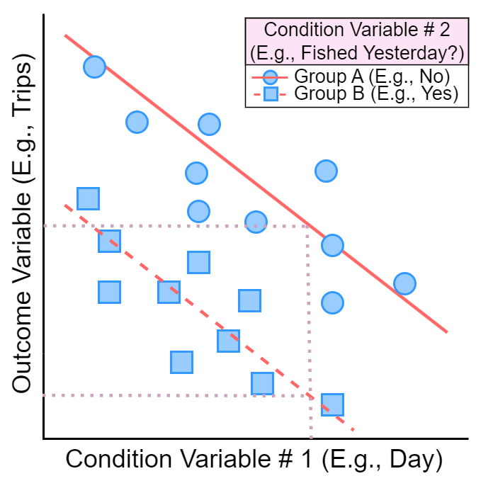

:::{.subtext style="margin-top: 2px"}
`r hr()`

**Lower Kuskokwim River Subsistence Fishery**
:::

:::{.subtext style="font-size: 18px;"}
`r paste0('Daily Drift Gillnet Harvest Based on ', min(KuskoHarvPred:::fit_data$year), '-', max(KuskoHarvPred:::fit_data$year), ' In-Season Monitoring')`
:::

:::{.subtext style="margin-top: 8px; margin-bottom: 2px; font-size: 14px;"}
_v`r packageVersion("KuskoHarvPred")`_

`r hr()`
:::

```{r knitr-setup, include = FALSE}
# NOTE FOR FUTURE PUBLICATION INSTANCES TO SHINYAPPS.IO
# THE PACKAGES THAT ARE ON GITHUB **MUST** BE INSTALLED TO THE DEPLOYING COMPUTER
# USING devtools::install_github()
# AND **NOT** devtools::build()
# OTHERWISE RSCONNECT WILL NOT KNOW WHERE TO FIND THESE PACKAGES

knitr::opts_chunk$set(echo = FALSE, fig.align = "center")
```

```{css}

/* Really only applies to the title */
h1 {
padding: 0px;
font-size: 2.5em;
font-variant: small-caps;
font-weight: 700;
text-decoration: underline;
}

/* For subtitle text */
div.subtext {
font-size: 22px;
margin-top: -10px;
margin-bottom: -10px;
margin-left: 20px;
margin-right: 20px;
}
/* Set-up .blue: for all collapsible details text*/
div.blue {
background-color: #e6f0ff;
border-radius: 5px;
padding: 5px;
margin-top: 8px;
margin-bottom: 8px;
border: solid;
border-width: 1px;
border-color: lightblue;
}

/* Set-up .indent, for all main blocks of text */
div.indent {
margin-left: 30px;
margin-right: 15px;
font-size: 14px;
text-align: justify;
}

/* TRYING TO REDUCE SPACING BEFORE AND AFTER CHECKBOX INPUTS. DOESN'T SEEM TO WORK THOUGH */
div.checkbox {
margin: 0px;
padding: 0px;
}

/* Set-up describe, for strong header text with nice spacing */
.describe {
font-weight: bold;
font-size: 15px;
margin-top: 10px;
margin-bottom: 10px;
margin-left: 10px;
}

/* tweak <summary>, make larger and bold */
summary {
font-size: 18px;
font-weight: 900;
}

/* tweak <p>, reduce spacing between paragraphs */
p {
margin-top: 4px;
margin-bottom: 4px;
}

/* tweak <ul>, reduce spacing after last list item */
ul {
margin-bottom: 4px;
}

/* tweak <ol>, reduce spacing after last list item */
ol {
margin-bottom: 4px;
}

/* tweak <hr>, reduce spacing before/after line */
hr {
margin-top: 2px;
margin-bottom: 2px;
}

/* standardize captions */
figcaption {
background-color: transparent;
color: grey;
padding: 5px;
margin-left: 60px;
margin-right: 60px;
text-align: left;
caption-side: top;
}

/* standardize captions */
caption {
background-color: transparent;
color: grey;
padding: 5px;
margin-left: 60px;
margin-right: 60px;
text-align: left;
caption-side: top;
}

/* standardize captions */
div.mycaption {
background-color: transparent;
color: grey;
padding: 5px;
margin-left: 60px;
margin-right: 60px;
text-align: left;
}

/* empty */
span.nospace {
letter-spacing: -18px;
}

/* align tooltip text */
.tooltip-inner {
text-align: left;
}

/* hanging indents for references section */
.reference {
padding-left: 36px;
text-indent: -20px;
margin-bottom: 6px;
}

/* less spacing at top/bottom of wellPanel */
.well {
padding-top: 6px;
padding-bottom: 6px;
}
```

```{r pkg-setup, warning = FALSE, message = FALSE}
# load packages
library(KuskoHarvUtils) # Houses several utility functions that are used across the KuskoHarv* Package Family
library(KuskoHarvEst)   # Houses workflow for producing harvest estimates, and some helper functions used here
library(KuskoHarvData)  # Houses historical data and functions to prepare them for analysis
library(KuskoHarvPred)  # Houses regression infrastructure and output
library(shiny)          # For building interactive elements
library(kableExtra)     # For making HTML Tables
library(lubridate)      # For dealing with dates/times
library(stringr)        # For dealing with character strings
library(bslib)          # For theming, also tooltip() won't work without using bs_theme()
library(shinysurveys)   # For numberInput(), which allows placeholder text unlike shiny::numericInput()
library(bsicons)        # For some nice icons; see full list: https://icons.getbootstrap.com/
library(RefManageR)     # For handling .bib files
```

```{r shinyjs-setup, warning = FALSE, message = FALSE}
library(shinyjs)        # For making interactive elements more user-friendly
useShinyjs(rmd = TRUE)  # Needed because we are using an interactive runtime: shiny document
```

```{r data-prep}
# extract the regression data set
fit_data = KuskoHarvPred:::fit_data

# all models fitted for each response variable
fit_lists = KuskoHarvPred:::fit_lists

# extract the leave-one-out cross-validation output
loo_output = KuskoHarvPred:::loo_output

# extract the unique years available
yrs = sort(unique(year(fit_data$date)))
```

```{r reactive-container}
rvals = reactiveValues()
```

```{r graphics-parameters-fn}
doc_par = function(
    mar = c(3.5, 3.5, 1, 1),
    mgp = c(1.5, 0.025, 0),
    tcl = -0.1,
    cex = 1.5,
    cex.axis = 0.9,
    lend = "square", ljoin = "mitre",
    cex.lab = 1.1, col.axis = "grey30", ...) {
  
  do.call(par, c(as.list(environment()), list(...), list(col.lab = col.axis)))
}
```

```{r app-fns}
# FUNCTIONS USED ONLY IN THE APP

# function to combine the selected date and times for an opener into a datetime object
process_datetime = function(date, time) {
  if (time == "12:00AM (End of Day)") date = date + 1
  new_time = str_remove(time, " \\(.+$")
  new_time = str_replace(time, "\\:00", ":00:00 ")
  new_datetime = parse_date_time(paste(date, new_time), '%Y-%m-%d %I:%M:%S %p', tz = "US/Alaska")
  as_datetime(new_datetime, tz = "US/Alaska")
}

# function to build the BTF Percentile dropdown menus
get_btf_percentiles = function(date, species) {
  
  # replace all past years in the date
  # for summarizing BTF stats on this date for all past years
  yrs = unique(fit_data$year)
  dates = rep(date, length(yrs))
  year(dates) = yrs
  
  # summarize the BTF CPUE for this species on this date for all past years
  cpue = sapply(dates, function(d) {
    KuskoHarvData:::summarize_btf(date = d, stat = paste0(tolower(species), "_cpue"), plus_minus = 1)
  })
  
  # calculate the CPUE percentiles
  cpue_percentiles = round(quantile(cpue, c(0.1, 0.25, 0.5, 0.75, 0.9)))
  
  # create names for the percentiles
  x = paste0(cpue_percentiles, " (", stringr::str_replace(names(cpue_percentiles), "\\%", "th Percentile"), ")")
  
  # assign names and add an "Enter..." option
  out = 1:6; names(out) = c(x, "Enter...")
  
  # return: ready to be passed to shiny::selectInput(..., choices)
  out
}

# wrapper around the bslib::tooltip() function
# label_text will be displayed with icon_use after it, but only icon_use triggers the display of tip_text
ttip = function(label_text, tip_text, icon_use = bs_icon("info-circle"), placement_use = "right") {
  tooltip(list(label_text, icon_use), tip_text, placement = placement_use)
}

# based on the input selections, set the CPUE to use for prediction
set_cpue = function(input, species) {
  
  # set the category name for this species
  cat_name = paste0(species, "_btf_cpue_input_cat")
  
  # if this is for a pre-calculated percentile (not manually entered)
  # extract that CPUE value from the percentile text
  # otherwise return the value that was manually entered
  if (input[[cat_name]] != "6") {
    out = names(get_btf_percentiles(input$date, species))[as.numeric(input[[cat_name]])] |> 
      stringr::str_extract("^[:digit:]+") |> 
      as.numeric()
  } else {
    out = input[[paste0("entered_", species, "_btf_cpue")]]
  }
  return(out)
}
```

::::::{.blue}
<details>
<summary>`r bs_icon("exclamation-triangle")` Information for New Users</summary>

`r hr()`

:::{.describe}
`r bs_icon("question-circle")` _What Does the Tool Do?_
:::

:::{.indent}
This tool predicts fishery outcomes from a fishery opener not exceeding 24-hours in duration, including

*  The number of drift boat  **trips/day**
*  The average **salmon catch/trip**
*  The **% species composition** of the catch (_Chinook, chum, and sockeye only_)

The daily harvest of each species can be predicted from these quantities, which can then inform managers about the likely outcomes of a proposed fishery opener based on past data.
:::

:::{.describe}
`r bs_icon("question-circle")` _How Does the Tool Work?_
:::

:::{.indent}
The tool relies on historical data to form relationships between past fishery outcomes and the fishery conditions they occurred under.
Fishery conditions might include features like:

*  The time of the season
*  The time of day or length of fishing period
*  Bethel Test Fishery CPUE indices of abundance and species composition

The `r bs_icon("graph-up-arrow")` **Predictive Relationships** tab displays how each outcome has historically varied throughout past seasons and how the predicted value changes depending on other fishery conditions.
The `r bs_icon("info-circle")` **Statistical Info.** tab (`r bs_icon("card-list")` **Methods Overview** section) includes many more details on how the tool works.

Learn about how the tool works by exploring the `r bs_icon("graph-up-arrow")` **Predictive Relationships** and `r bs_icon("info-circle")` **Statistical Info.** > `r bs_icon("card-list")` **Methods Overview** tabs.
Learn more about how good the predictions are likely to be by exploring the `r bs_icon("info-circle")` **Statistical Info.** > `r bs_icon("crosshair")` **Cross-Validation** tab.

:::

:::{.describe}
`r bs_icon("question-circle")` _How Is the Tool Used?_
:::

:::{.indent}
1.  Enter the expected conditions of the proposed fishery opener (day, start/end times, Bethel Test Fishery CPUE values) on the `r bs_icon("sliders")` **Inputs** tab
2.  Navigate to the `r bs_icon("table")` **Outputs** tab to find the predictions of each outcome and species-specific harvest they imply based on the input selections.
3.  (_Optional_) Click the `r icon("gears") `**Adjust Predictions** check box to assess the uncertainty in the predictions and compare results to personal expectations.
:::

:::{.describe}
`r bs_icon("question-circle")` _Where do the data come from?_
:::

:::{.indent}
Historical fishery outcomes are informed by data collected collaboratively by several projects/agencies: Orutsararmiut Native Council, the [Community-Based Harvest Monitoring Program](https://static1.squarespace.com/static/5afdc3d5e74940913f78773d/t/622fc731ca40712f2235eda1/1647298414521/CBHM+2021+Report_final.pdf) (Kuskokwim River Inter-Tribal Fisheries Commission), and the U.S. Fish and Wildlife Service. 
The exact data set can be found in the `r bs_icon("search")` **Data Explorer** tab.
More information about data collection can be found in the `r bs_icon("chevron-right")` **More Info** > `r bs_icon("newspaper")` **Relevant Literature** tab.
Because of the scope of the monitoring data, predictions made by this tool apply only to:

*  Drift nets (no other gears are included)
*  Mainstem Kuskokwim River (no tributaries are included)
*  The area between the villages of Tuntutuliak and Akiak

The data informing this tool were collected in June and July in the years `r min(yrs)`-`r max(yrs)` and are made up of `r nrow(fit_data)` individual days of monitored drift fishing.
:::

</details>
::::::

# {.tabset .tabset-pills}

## `r bs_icon("sliders")` Inputs

::::::{.blue}
<details>
<summary>`r bs_icon("info-circle")` Information about `r bs_icon("sliders")` Inputs</summary>

`r hr()`

:::{.describe}
Enter the conditions of the proposed opener, including when it would occur and what the Bethel Test Fishery CPUE has been like this year.
:::

:::{.indent}
The values entered here will be "plugged in" to historical relationships to predict outcomes for these conditions.

**Opener Timing**

Start by entering the date and the start/end times.
Be sure to check the box labeled "Fished Previous Day?" if fishing was/will be allowed the day before the date you pick.

**Bethel Test Fishery CPUE**

Next, select the expected Bethel Test Fishery daily catch-per-unit-effort (CPUE) for the proposed fishing day.
For each species, pick either one of the 10^th^, 25^th^, 50^th^ (median), 75^th^, or 90^th^ percentiles, or choose to enter your own CPUE value.
A **CPUE percentile** (for example, 25^th^) is the CPUE value that 25% of years (since 2016) fell below for the selected date.
Selecting the 50^th^ percentile means that CPUE has been approximately average this year, whereas selecting the 90^th^ percentile means CPUE has been much higher than average.
:::

</details>
::::::

```{r initialize-date-times}
# calculate the default date for the opener
year = year(today())
default_date = max(as_date(paste0(year, "-06-12")), today() + 3)
min_date = as_date(paste0(year, "-06-12"))
max_date = as_date(paste0(year, "-07-31"))
if (default_date > max_date) default_date = max_date
if (default_date < min_date) default_date = min_date

# create the "time banks": the potential start and end times for an opener
start_time_bank = c("12:00AM (Start of Day)", paste0(1:11, ":00AM"), paste0(c(12, 1:11), ":00PM"))
end_time_bank = c("12:00AM (Start of Day)", paste0(1:11, ":00AM"), paste0(c(12, 1:11), ":00PM"), "12:00AM (End of Day)")
```

```{r input-widgets}
# set the tooltip text for all manual entry CPUE boxes
enter_CPUE_ttip_text = "The model uses Bethel Test Fishery CPUE values averaged over 3 days, so try not to enter extreme high or low values — just what you expect CPUE to be for the selected day."

fillRow(
  height = "80%", flex = c(40,1,40),
  
  # input widgets for opener timing info
  column(
    width = 12,
    h4(strong("Opener Timing")),
    wellPanel(
      
      # describe why user needs to enter this
      helpText(
        ttip("Why is this Important", p("Day of the season is useful for predicting trips/day, catch/trip, and species composition. The opener duration and time of day also helps to predict trips/day. See the ", bs_icon("graph-up-arrow"), strong("Predictive Relationships"), "tab for details."), icon_use = bs_icon("question-circle"))
      ),
      
      hr(),
      
      # input widget for date of opener
      dateInput(
        inputId = "date", label = strong(bs_icon("calendar-event"), "Day of Opener"),
        value = default_date, min = min_date, max = max_date, format = "mm-dd-yyyy"
      ),
      
      # input widgets for start/stop time of opener
      selectInput(
        inputId = "start_time", label = strong(bs_icon("clock"), "Start Time"),
        choices = start_time_bank, selected = "10:00AM"
      ),
      selectInput(
        inputId = "end_time", label = strong(bs_icon("clock"), "End Time"),
        choices = end_time_bank, selected = "10:00PM"
      ),
      
      # input widget for whether fishing occurred the previous day,
      # with tooltip for why this is important
      checkboxInput(
        inputId = "fished_yesterday", value = FALSE,
        label = ttip("Fished Previous Day?", p("The number of trips and catch/trip is much lower when the fishery was open the previous day. See the ", bs_icon("graph-up-arrow"), strong("Predictive Relationships"), "tab for details.", tags$u(strong("Be sure to check this box if this applies."))))
      )
    )
  ),
  
  # Add space between the columns
  # without this, they are bumped right up against eachother
  column(
    width = 1
  ),
  
  # input widgets for BTF info
  column(
    width = 12,
    h4(strong("Bethel Test Fishery CPUE")),
    wellPanel(
      
      # describe why user needs to enter this and what percentiles are
      helpText(
        ttip("Why is this Important", "Fishery catch/trip and species composition are related to BTF total CPUE and species breakdown — the model uses these to predict outcomes.", icon_use = bs_icon("question-circle")),
        ttip("Percentiles", markdown("A 25<sup>th</sup> CPUE percentile is the CPUE value that 25% of years (since 2016) fell below for the selected date. The 50<sup>th</sup> percentile is also called the median."), icon_use = bs_icon("question-circle"))
      ),
      
      hr(),
      
      # input widget for Chinook BTF CPUE selections (based on pre-calculated percentiles)
      selectInput(
        inputId = "chinook_btf_cpue_input_cat", label = strong(icon("fish-fins"), "Chinook Salmon CPUE"),
        choices = get_btf_percentiles(date = default_date, species = "chinook"), selected = 3
      ),
      
      # input widget for  Chinook BTF CPUE manual entry
      hidden(
        div(
          id = "enter_chinook_btf_cpue",
          numberInput(
            inputId = "entered_chinook_btf_cpue", 
            label = ttip(strong("Enter Chinook Salmon CPUE"), enter_CPUE_ttip_text),
            value = NULL, min = 0, placeholder = "Enter a CPUE value"
          )
        )
      ),
      
      # input widget for chum BTF CPUE selections (based on pre-calculated percentiles)
      selectInput(
        inputId = "chum_btf_cpue_input_cat", label = strong(icon("fish-fins"), "Chum Salmon CPUE"),
        choices = get_btf_percentiles(date = default_date, species = "chum"), selected = 3
      ),
      
      # input widget for chum BTF CPUE manual entry
      hidden(
        div(
          id = "enter_chum_btf_cpue",
          numberInput(
            inputId = "entered_chum_btf_cpue",
            label = ttip(strong("Enter Chum Salmon CPUE"), enter_CPUE_ttip_text),
            value = NULL, min = 0, placeholder = "Enter a CPUE value"
          )
        )
      ),
      
      # input widget for sockeye BTF CPUE selections (based on pre-calculated percentiles)
      selectInput(
        inputId = "sockeye_btf_cpue_input_cat", label = strong(icon("fish-fins"), "Sockeye Salmon CPUE"),
        choices = get_btf_percentiles(date = default_date, species = "sockeye"), selected = 3
      ),
      
      # input widget for sockeye BTF CPUE manual entry
      hidden(
        div(
          id = "enter_sockeye_btf_cpue",
          numberInput(
            inputId = "entered_sockeye_btf_cpue", 
            label = ttip(strong("Enter Sockeye Salmon CPUE"), enter_CPUE_ttip_text), 
            value = NULL, min = 0, placeholder = "Enter a CPUE value"
          )
        )
      ),
      
      # where to find this year's BTF data
      helpText(
        a(bs_icon("table"), "View BTF Data Webpage", href = "https://www.adfg.alaska.gov/index.cfm?adfg=commercialbyareakuskokwim.btf")
      )
    )
  )
)

# update the CPUE selections depending on the date
# re-calculates percentiles and re-poulates dropdown menus when input$date is changed
observeEvent(input$date, {
  updateSelectInput(
    inputId = "chinook_btf_cpue_input_cat", selected = input$chinook_btf_cpue_input_cat,
    choices = get_btf_percentiles(date = input$date, species = "chinook")
  )
  updateSelectInput(
    inputId = "chum_btf_cpue_input_cat", selected = input$chum_btf_cpue_input_cat,
    choices = get_btf_percentiles(date = input$date, species = "chum")
  )
  updateSelectInput(
    inputId = "sockeye_btf_cpue_input_cat", selected = input$sockeye_btf_cpue_input_cat,
    choices = get_btf_percentiles(date = input$date, species = "sockeye")
  )
})

# if selected "Enter...", show box to enter
observe({
  toggle(id = "enter_chinook_btf_cpue", condition = input$chinook_btf_cpue_input_cat == 6, anim = TRUE, time = 0.3)
  toggle(id = "enter_chum_btf_cpue", condition = input$chum_btf_cpue_input_cat == 6, anim = TRUE, time = 0.3)
  toggle(id = "enter_sockeye_btf_cpue", condition = input$sockeye_btf_cpue_input_cat == 6, anim = TRUE, time = 0.3)
})

# ensure only end times after the selected start time are available to be selected
observeEvent(input$start_time, {
  updateSelectInput(
    inputId = "end_time",
    choices = end_time_bank[(which(end_time_bank == input$start_time) + 1):length(end_time_bank)],
    selected = input$end_time)
})
```

## `r bs_icon("table")` Outputs

::::::{.blue}
<details>
<summary>`r bs_icon("info-circle")` Information about `r bs_icon("table")` Outputs</summary>

`r hr()`

:::{.describe}
This page displays the model-predicted outcomes and harvest based on the input conditions.

You may also adjust the predictions to align with your expectations, _but this feature should be used with caution_.
:::

:::{.indent}
**Model-Predicted Values**

The table shows the predicted values for each outcome variable: drift trips, catch per trip, and % species composition.
Predictions are obtained using relationships shown on the `r bs_icon("graph-up-arrow")` **Predictive Relationships** tab.

The table also shows the harvest by species implied by the predicted outcomes, and are obtained by multiplying drift trips, catch per trip, and species composition.

**User-Adjusted Predictions**

If you check the box labeled `r icon("gears")` **Adjust Predictions**, you can set the outcome variables to specific values (or ranges of values) to align with what you expect to occur.
The output you select and the implied predicted harvest will be displayed in the table as well.
Note that the species composition predictions must add up to 100% -- if you change the value for one species, the other two species will change automatically to ensure this.
:::

</details>
::::::

```{r regression-predictions}
# convert widget inputs to usable formats for regression 
reactive({
  # format input date/time (three widgets) as two datetime objects
  rvals$start_time = process_datetime(input$date, input$start_time)
  rvals$end_time = process_datetime(input$date, input$end_time)
  
  # calculate the duration of the opener
  rvals$hours_open = as.numeric(as.duration(interval(rvals$start_time, rvals$end_time)), units = "hours")
  
  # calculate the number of hours before noon
  rvals$hours_before_noon = as.numeric(as.duration(interval(rvals$start_time, as_datetime(paste0(input$date, " 12:00:00"), tz = "US/Alaska"))), units = "hours")
  
  # select the correct CPUE based on the inputs
  rvals$chinook_btf_cpue = set_cpue(input, "chinook")
  rvals$chum_btf_cpue = set_cpue(input, "chum")
  rvals$sockeye_btf_cpue = set_cpue(input, "sockeye")
})

# create the complete predictive data set based on widget inputs
reactive({
  rvals$df = data.frame(
    day = KuskoHarvUtils::to_days_past_may31(dates = input$date),
    weekend = wday(input$date, label = TRUE) %in% c("Sat", "Sun"),
    fished_yesterday = input$fished_yesterday,
    hours_open = rvals$hours_open,
    p_before_noon = ifelse(rvals$hours_before_noon < 0, 0, rvals$hours_before_noon/rvals$hours_open),
    total_btf_cpue = rvals$chinook_btf_cpue + rvals$chum_btf_cpue + rvals$sockeye_btf_cpue,
    chinook_btf_comp = rvals$chinook_btf_cpue/(rvals$chinook_btf_cpue + rvals$chum_btf_cpue + rvals$sockeye_btf_cpue),
    chum_btf_comp = rvals$chum_btf_cpue/(rvals$chinook_btf_cpue + rvals$chum_btf_cpue + rvals$sockeye_btf_cpue),
    sockeye_btf_comp = rvals$sockeye_btf_cpue/(rvals$chinook_btf_cpue + rvals$chum_btf_cpue + rvals$sockeye_btf_cpue)
  )
})

# produce regression model predictions
reactive({
  # obtain predicted response variables
  rvals$preds = as.data.frame(lapply(fit_lists, function(fit_list) predict_model_avg(fit_list, rvals$df)))
  
  # restandardize composition variables
  rvals$comp_preds = c(chinook = rvals$preds$chinook_comp,  chum = rvals$preds$chum_comp, sockeye = rvals$preds$sockeye_comp)
  rvals$comp_preds_adj = smart_round(rvals$comp_preds/sum(rvals$comp_preds), 2)
})
```

```{r user-adjustment-ui}
# allow user to tweak predictions
checkboxInput(
  inputId = "show_user_adjust_preds", value = FALSE, 
  label = ttip(list(icon("gears"), "Adjust Predictions?"),
               p("If you have reason to believe the outcomes will be much different, click here to compare your expectations to model predictions.", em(strong("Use with caution."))))
)

fillRow(
  flex = c(40,1,40),
  # table showing output of predictions
  column(
    width = 12,
    h4(strong("Predictions")),
    helpText(
      "Model-predicted outcomes come from the relationships in the ", bs_icon("graph-up-arrow"), strong("Predictive Relationships"), "tab. Harvest predictions come from multiplying drift trips", HTML("&#215;"), "salmon catch/trip", HTML("&#215;"), "species composition."
    ),
    wellPanel(
      renderUI(HTML(rvals$preds_kable))
    )
  ),
  
  # Add space between the columns
  # without this, they are bumped right up against eachother
  column(
    width = 1
  ),
  
  # optional sliders to adjust model-predicted values
  hidden(
    div(
      id = "user_adjust_preds",
      column(
        width = 12,
        h4(icon("gears"), strong("Adjust Predictions")),
        helpText("Adjust the ranges and percentages as you see fit. The default values are centered on the model prediction, and the range represents", HTML('&#177;'), "1 median absolute % error).")),
      wellPanel(
        sliderInput("user_effort", strong("Trips/Day"), min = 0, max = 1000, value = c(500, 700), step = 10),
        sliderInput("user_total_cpt", strong("Catch/Trip"), min = 0, max = 100, value = c(10, 20), step = 1),
        sliderInput("user_chinook_comp", strong("% Chinook"), min = 0, max = 100, value = 50, post = "%"),
        sliderInput("user_chum_comp", strong("% Chum"), min = 0, max = 100, value = 25, post = "%"),
        sliderInput("user_sockeye_comp", strong("% Sockeye"), min = 0, max = 100, val = 25, post = "%"),
        actionButton("reset_user", "Reset to Defaults", icon("sync"), class = "btn-primary", width = "100%")
      )
    )
  )
)

# function to set the values of the user-adjusted sliders
update_user_sliders = function(input, rvals) {
  
  # get the LOO MAPE for error and catch/trip
  effort_error = KuskoHarvPred:::get_mape("effort", get_period(input$date)) * rvals$preds$effort
  total_cpt_error = KuskoHarvPred:::get_mape("total_cpt", get_period(input$date)) * rvals$preds$total_cpt
  
  # update the sliders based on predictions
  updateSliderInput(
    inputId = "user_effort", 
    value = c(max(0, round(rvals$preds$effort - effort_error, -1)), min(1000, round(rvals$preds$effort + effort_error, -1)))
  )
  updateSliderInput(
    inputId = "user_total_cpt", 
    value = c(max(0, ceiling(rvals$preds$total_cpt - total_cpt_error)), min(1000, round(rvals$preds$total_cpt + total_cpt_error)))
  )
  updateSliderInput(inputId = "user_chinook_comp", value = unname(rvals$comp_preds_adj["chinook"] * 100))
  updateSliderInput(inputId = "user_chum_comp", value = unname(rvals$comp_preds_adj["chum"] * 100))
  updateSliderInput(inputId = "user_sockeye_comp", value = unname(rvals$comp_preds_adj["sockeye"] * 100))
}

# if predicted values change, reset the sliders
observeEvent(rvals$preds, {
  update_user_sliders(input, rvals)
})

# if the "reset" button is clicked, reset the sliders
observeEvent(input$reset_user, {
  update_user_sliders(input, rvals)
})

# function to calculate the value of two composition sliders when the third is changed
# to ensure they sum to 100%
get_other_percents = function(inputId_changed, inputs) {
  
  # names of all sliders
  all_inputIds = c("user_chinook_comp", "user_chum_comp", "user_sockeye_comp")
  
  # which were not changed
  remaining_inputIds = all_inputIds[-which(all_inputIds == inputId_changed)]
  
  # amount needed to distribute among the unchanged sliders
  remaining = 100 - inputs[[inputId_changed]]
  
  # proportion of the remaining that should be apportioned to each unchanged slider
  # keep ratio of two unchanged sliders the same
  p_remaining_A = inputs[[remaining_inputIds[1]]]/(inputs[[remaining_inputIds[1]]] + inputs[[remaining_inputIds[2]]])
  p_remaining_B = inputs[[remaining_inputIds[2]]]/(inputs[[remaining_inputIds[1]]] + inputs[[remaining_inputIds[2]]])
  
  # create the output vector
  out = remaining * c(p_remaining_A, p_remaining_B)
  names(out) = remaining_inputIds
  out
}

# when the chinook comp is changed, adjust the other two to sum top 100%
observeEvent(input$user_chinook_comp, {
  other_percents = get_other_percents("user_chinook_comp", input)
  updateSliderInput(inputId = "user_chum_comp", value = unname(other_percents["user_chum_comp"]))
  updateSliderInput(inputId = "user_sockeye_comp", value = unname(other_percents["user_sockeye_comp"]))
})

# when the chum comp is changed, adjust the other two to sum top 100%
observeEvent(input$user_chum_comp, {
  other_percents = get_other_percents("user_chum_comp", input)
  updateSliderInput(inputId = "user_chinook_comp", value = unname(other_percents["user_chinook_comp"]))
  updateSliderInput(inputId = "user_sockeye_comp", value = unname(other_percents["user_sockeye_comp"]))
})

# when the sockeye comp is changed, adjust the other two to sum top 100%
observeEvent(input$user_sockeye_comp, {
  other_percents = get_other_percents("user_sockeye_comp", input)
  updateSliderInput(inputId = "user_chinook_comp", value = unname(other_percents["user_chinook_comp"]))
  updateSliderInput(inputId = "user_chum_comp", value = unname(other_percents["user_chum_comp"]))
})

# remove the user adjustment UI if checkbox is not checked
observe({
  toggle(id = "user_adjust_preds", condition = input$show_user_adjust_preds)
})
```

```{r preds-kable}

# function to create output table
preds_kable = function(input, rvals) {
  
  # process regression model predictions: always displayed
  model_effort = round(rvals$preds$effort)
  model_total_cpt = ceiling(rvals$preds$total_cpt)
  model_chinook_comp = rvals$comp_preds_adj["chinook"]
  model_chum_comp = rvals$comp_preds_adj["chum"]
  model_sockeye_comp = rvals$comp_preds_adj["sockeye"]
  model_total_harv = model_effort * model_total_cpt
  model_chinook_harv = round(model_total_harv * model_chinook_comp)
  model_chum_harv = round(model_total_harv * model_chum_comp)
  model_sockeye_harv = round(model_total_harv * model_sockeye_comp)
  model_total_harv = model_chinook_harv + model_chum_harv + model_sockeye_harv
  
  # combine individual quantities into nice formatted data frame for easy kable
  model_preds = data.frame(
    quantity = c("Trips/Day", "Catch/Trip", "% Chinook", "% Chum", "% Sockeye", "Chinook", "Chum", "Sockeye", "Total"),
    model = c(prettyNum(model_effort, big.mark = ",", scientific = FALSE), model_total_cpt, KuskoHarvUtils::percentize(c(model_chinook_comp, model_chum_comp, model_sockeye_comp)), prettyNum(c(model_chinook_harv, model_chum_harv, model_sockeye_harv, model_total_harv), big.mark = ",", scientific = FALSE))
  )
  
  # if allowing user-adjusted predictions
  if (input$show_user_adjust_preds) {
    
    # obtain user-adjusted predictions
    user_effort = round(input$user_effort)
    user_total_cpt = ceiling(input$user_total_cpt)
    user_chinook_comp = input$user_chinook_comp/100
    user_chum_comp = input$user_chum_comp/100
    user_sockeye_comp = input$user_sockeye_comp/100
    user_total_harv = user_effort * user_total_cpt
    user_chinook_harv = round(user_total_harv * user_chinook_comp)
    user_chum_harv = round(user_total_harv * user_chum_comp)
    user_sockeye_harv = round(user_total_harv * user_sockeye_comp)
    user_total_harv = user_chinook_harv + user_chum_harv + user_sockeye_harv
    
    user_effort[3] = round(mean(user_effort))
    user_total_cpt[3] = round(mean(user_total_cpt))
    user_chinook_harv[3] = round(mean(user_chinook_harv))
    user_chum_harv[3] = round(mean(user_chum_harv))
    user_sockeye_harv[3] = round(mean(user_sockeye_harv))
    user_total_harv[3] = round(mean(user_total_harv))
    
    # make into a nice data frame
    make_est = function(i) {
      c(
        prettyNum(user_effort[i], big.mark = ",", scientific = FALSE),
        user_total_cpt[i], 
        percentize(c(user_chinook_comp, user_chum_comp, user_sockeye_comp)),
        prettyNum(c(user_chinook_harv[i], user_chum_harv[i], user_sockeye_harv[i], user_total_harv[i]), big.mark = ",", scientific = FALSE))
    }
    user_preds = data.frame(
      quantity = c("Trips/Day", "Catch/Trip", "% Chinook", "% Chum", "% Sockeye", "Chinook", "Chum", "Sockeye", "Total"),
      user_lwr = make_est(1),
      user_mid = make_est(3),
      user_upr = make_est(2)
    )
    
    # combine with the regression predictions
    preds = merge(model_preds, user_preds, by = "quantity", sort = FALSE)
    col_names = c(" ", "Model", "User Min.", "User Mid.", "User Max.")
    align = "lcccc"
    header = c('<span class="nospace"> </span>' = 1, "Predicted Values" = 4)
  } else {
    preds = model_preds
    col_names = c(" ", "Model")
    align = "lc"
    header = c('<span class="nospace"> </span>' = 1, "Predicted Values" = 1)
  }
  
  # create the kable
  kbl(preds, "html", col.names = col_names, align = align) |>
    kable_styling(full_width = FALSE, bootstrap_options = c("condensed")) |>
    column_spec(1, bold = FALSE, italic = TRUE) |>
    pack_rows("Fishery Outcome Variables", 1, 5, background = "#F7F7F7") |>
    pack_rows("Harvest", 6, 9, hline_before = TRUE, background = "#F7F7F7") |>
    add_header_above(header, background = "#F7F7F7", escape = FALSE) |> 
    row_spec(0:nrow(preds), background = "#F7F7F7")
}

# create the table
reactive({
  rvals$preds_kable = preds_kable(input, rvals)
})
```

## `r bs_icon("graph-up-arrow")` Predictive Relationships {#section-relationships-tab}

::::::{.blue}
<details>
<summary>`r bs_icon("info-circle")` Information about `r bs_icon("graph-up-arrow")` Predictive Relationships</summary>

`r hr()`

:::{.describe}
This page displays the relationships between historical outcomes and conditions.
:::

:::{.indent}
In the figure displayed on this page, each blue point represents an opener -- the _x_-axis shows the date the opener occurred and the _y_-axis shows the value of the outcome variable.
Red lines show the model prediction at the selected values of the condition variables. 

If **Show Uncertainty** is checked, a region around the model predicted value will be displayed -- this represents &#177;1 median absolute % error (MAPE) and is the area we would expect outcomes to occur on average due to random variability that the model cannot predict (see `r bs_icon("info-circle")` **Statistical Info.** > `r bs_icon("crosshair")` **Cross-Validation** for more information).
MAPE is calculated based which time period of the season the prediction is made, which is why the uncertainty bands are not smooth like the model-predicted curve. 

Not all condition variables are used to predict all outcome variables.
For example, "Hours Open" is a condition variable that is used to predict drift trips/day and catch/trip, but not the species composition outcome variables.
This is why "Hours Open" disappears when viewing the species composition relationships.
:::

</details>
::::::

```{r plot-ui}

# drop down menu options for BTF categories
CAT_btf_choices = c(
  "10th Percentile (Near Lowest)" = "q10",
  "25th Percentile" = "q25",
  "50th Percentile (Median)" = "q50",
  "75th Percentile" = "q75",
  "90th Percentile (Near Highest)" = "q90"
)

# drop down menu options for response variables
response_choices = c(
  "Trips/Day" = "effort",
  "Catch/Trip" = "total_cpt",
  "% Chinook" = "chinook_comp",
  "% Chum" = "chum_comp",
  "% Sockeye" = "sockeye_comp"
)

# input widgets: which response variable and whether to draw uncertainty
fillRow(flex = c(2,3),
        column(width = 12, selectInput(inputId = "plot_response", label = p("Outcome Variable", style = "font-size: 15pt; font-weight: bold;"), choices = response_choices, width = "95%")),
        column(width = 12, br(), br(), checkboxInput("draw_mape_range", "Show Uncertainty", value = TRUE))
)

br()
br()
br()
br()
p(strong("Condition Variables"), style = "font-size: 15pt;")

fillRow(
  column(
    width = 12,
    
    # input widget for the total BTF cpue category to show (hidden by default, shown if in global model for response variable)
    hidden(
      selectInput(inputId = "plot_CAT_total_btf_cpue", label = strong("Total BTF CPUE"), choices = CAT_btf_choices, selected = "q50")
    ),
    
    # input widget for the BTF % Chinook category to show (hidden by default, shown if in global model for response variable)
    hidden(
      selectInput(inputId = "plot_CAT_chinook_btf_comp", label = strong("BTF % Chinook"), choices = CAT_btf_choices, selected = "q50")
    ),
    
    # input widget for the BTF % chum category to show (hidden by default, shown if in global model for response variable)
    hidden(
      selectInput(inputId = "plot_CAT_chum_btf_comp", label = strong("BTF % Chum"), choices = CAT_btf_choices, selected = "q50")
    ),
    
    # input widget for the BTF % sockeye category to show (hidden by default, shown if in global model for response variable)
    hidden(
      selectInput(inputId = "plot_CAT_sockeye_btf_comp", label = strong("BTF % Sockeye"), choices = CAT_btf_choices, selected = "q50")
    )
  ),
  
  column(
    width = 12,
    
    # input widget for hours open category to show (hidden by default, shown if in global model for response variable)
    hidden(
      selectInput(inputId = "plot_hours_open", label = strong("Hours Open"), choices = c("6", "12", "18", "24"), selected = "12")
    ),
    
    # input widget for %open before category to show (hidden by default, shown if in global model for response variable)
    hidden(
      selectInput(inputId = "plot_p_before_noon", label = strong("% Hours Open Before Noon"), choices = c("0%" = "0", "25%" = "0.25", "50%" = "0.50", "75%" = "0.75", "100%" = 1), selected = "0.25")
    )
  )
)

```

```{r plot-server}
# Extract all predictor variable names for this response variable
reactive({
  rvals$vars = KuskoHarvPred:::find_variables(fit_lists[[input$plot_response]])
})

# Toggle the various plot settings widgets based on whether that covariate is in any models for that response variable
observe({
  toggle(id = "plot_hours_open", condition = "hours_open" %in% rvals$vars)
  toggle(id = "plot_p_before_noon", condition = "p_before_noon" %in% rvals$vars)
  toggle(id = "plot_CAT_total_btf_cpue", condition = "total_btf_cpue" %in% rvals$vars)
  toggle(id = "plot_CAT_chinook_btf_comp", condition = "chinook_btf_comp" %in% rvals$vars)
  toggle(id = "plot_CAT_chum_btf_comp", condition = "chum_btf_comp" %in% rvals$vars)
  toggle(id = "plot_CAT_sockeye_btf_comp", condition = "sockeye_btf_comp" %in% rvals$vars)
})

# Construct the settings for subsetting pre-processed predictions for plotting
reactive({
  rvals$plot_settings = list(
    hours_open = as.numeric(input$plot_hours_open),
    p_before_noon = as.numeric(input$plot_p_before_noon),
    CAT_total_btf_cpue = input$plot_CAT_total_btf_cpue,
    CAT_chinook_btf_comp = input$plot_CAT_chinook_btf_comp,
    CAT_chum_btf_comp = input$plot_CAT_chum_btf_comp,
    CAT_sockeye_btf_comp = input$plot_CAT_sockeye_btf_comp
  )
})
```

```{r}
# FIXME: eventually we will learn something better than this!
br()
br()
br()
br()
br()
br()
br()
```

:::{.mycaption}
**Relationship between `r renderText(KuskoHarvUtils::get_var_name(input$plot_response, is_title = FALSE))` and day of the season.**
Blue points are observed outcomes and red lines are model-predicted outcomes (shaded region is &#177;1 median absolute percent error).
Select from the other drop-down menus to see how changing the condition variable affects predictions.
:::

```{r plot-output}
# plot the relationship between the response variable and day of the season
# settings argument is a list that says which prediction covariates to keep and display
# e.g., default is to plot with mean BTF values, but could supply "min" or "max" to see how this changes predicted curve

div(
  style = "margin: auto; width: 60%",
  renderPlot(expr = {
    doc_par()
    relationship_plot(response = input$plot_response,
                      settings = rvals$plot_settings,
                      dat = fit_data,
                      separate_day_types = TRUE,
                      pred_day = NULL,
                      pred_response = NULL,
                      draw_mape_range = input$draw_mape_range
    )
  })
)
```

## `r bs_icon("search")` Data Explorer {.tabset}

:::{.blue}
<details>
<summary>`r bs_icon("info-circle")` Information about `r bs_icon("search")` Data Explorer</summary>

`r hr()`

:::{.describe}
This page displays the data used by the predictive relationships.
:::

:::{.indent}
`r bs_icon("table")` **Outcome Data**

This tab shows the outcomes and harvest from each day of monitored drift boat fishing.
Each row is one day, and you can filter rows by specific values by clicking the `r icon("filter")` "Show/Hide Filters" link.

`r bs_icon("table")` **Condition Data**

This tab shows the conditions used to predict outcomes from each day of monitored drift boat fishing.
Each row is one day, and you can filter rows by specific values by clicking the `r icon("filter")` "Show/Hide Filters" link.

`r bs_icon("graph-up")` **Scatter Plots**

This tab allows visualizing the relationship between any variables in the analysis (whereas `r bs_icon("graph-up-arrow")` **Predictive Relationships** only shows date along the _x_-axis).
No model predictions are shown here, only the data values, however you can select to color-code points based on the period of the season and label the years if you wish.
:::

</details>
::::::

### `r bs_icon("table")` Outcome Data

```{r outcome-data-UI}
# link to show/hide data filters UI
actionLink("show_hide_resp_kable_filters", label = "Show/Hide Filters", icon = icon("filter"))

# build the list of period choices
period_names = paste0("Period ", 1:3, " (", make_period_labels(last_day = max(fit_data$day)), ")")
period_choices = list(1,2,3)
names(period_choices) = period_names

# UI elements for filtering the outcome data
hidden(
  div(
    id = "resp_kable_filters",
    fillRow(
      flex = c(1,1),
      
      # Filters by time period
      column(
        width = 12,
        h3(icon("filter"), "Time Periods"),
        wellPanel(
          # filter by year
          selectizeInput(
            inputId = "resp_kable_years", label = strong("Years"), choices = yrs, selected = yrs, multiple = TRUE,
            options = list(placeholder = "Select one or more years", plugins = list("remove_button"))
          ),
          
          # filter by period
          selectizeInput(
            inputId = "resp_kable_periods", label = strong("Periods"), selected = c(1,2,3), multiple = TRUE,
            choices = period_choices, options = list(placeholder = "Select one or more periods", plugins = list("remove_button"))
          ),
          actionButton("filter_resp_periods_select_all", "Select All", width = "100%", icon = icon("check"), class = "btn-primary")
        )
      ),
      
      # Filter by outcome
      column(
        width = 12,
        h3(icon("filter"), "Outcomes"),
        wellPanel(
          # filter by effort
          sliderInput(
            inputId = "resp_kable_effort", label = strong("Drift Trips"), value = range(fit_data$effort), 
            min = min(fit_data$effort), max = max(fit_data$effort), width = "95%"
          ),
          
          # filter by catch/trip
          sliderInput(
            inputId = "resp_kable_total_cpt", label = strong("Catch/Trip"), value = range(round(fit_data$total_cpt)), 
            min = min(round(fit_data$total_cpt)), max = max(round(fit_data$total_cpt)), width = "95%"
          ),
          
          # filter by % Chinook
          sliderInput(
            inputId = "resp_kable_chinook_comp", label = strong("% Chinook"), value = range(round(fit_data$chinook_comp, 2) * 100),
            min = min(round(fit_data$chinook_comp, 2)) * 100, max = max(round(fit_data$chinook_comp, 2)) * 100, post = "%", width = "95%"
          ),
          
          # click to reset to select all
          actionButton("filter_outcomes_select_all", "Select All", width = "100%", icon = icon("check"), class = "btn-primary")
        )
      )
    ),
    
    # empty space between filters and the table
    # FIXME: eventually we will learn something better than this!
    br(),
    br(),
    br(),
    br(),
    br(),
    br(),
    br(),
    br(),
    br(),
    br(),
    br(),
    br(),
    br(),
    br(),
    br(),
    br(),
    br(),
    br(),
    br(),
    br(),
    br(),
    br()
  )
)

# show or hide filters when the action link is clicked
observeEvent(input$show_hide_resp_kable_filters, {
  toggle(id = "resp_kable_filters")
})

# reset the time period filters to default when action button is clicked
observeEvent(input$filter_resp_periods_select_all, {
  updateSelectizeInput(inputId = "resp_kable_years", selected = yrs)
  updateSelectizeInput(inputId = "resp_kable_periods", selected = c(1,2,3))
})

# reset the outcome filters to default when action button is clicked
observeEvent(input$filter_outcomes_select_all, {
  updateSliderInput(inputId = "resp_kable_effort", value = range(fit_data$effort))
  updateSliderInput(inputId = "resp_kable_total_cpt", value = range(round(fit_data$total_cpt)))
  updateSliderInput(inputId = "resp_kable_chinook_comp", value = range(round(fit_data$chinook_comp, 2) * 100))
})

```

```{r outcome-data-fn}
# function to create the response varible table
resp_kable = function(period_keep, year_keep, effort_range, total_cpt_range, chinook_comp_range) {
  
  # create the data set
  table_dat = fit_data
  data("meta", package = "KuskoHarvData")
  meta$date = date(meta$start)
  table_dat = merge(x = meta, y = table_dat, by = "date", sort = FALSE, all.x = FALSE, all.y = TRUE)
  
  # format the variables
  table_dat$total_cpt = round(table_dat$total_cpt)
  table_dat = cbind(year = as.character(year(table_dat$date)), table_dat)
  table_dat$chinook_comp = round(table_dat$chinook_comp, 2)
  table_dat$chum_comp = round(table_dat$chum_comp, 2)
  table_dat$sockeye_comp = round(table_dat$sockeye_comp, 2)
  
  # determine whether each record meets the inclusion criterion based on the input filters
  effort_in = table_dat$effort >= effort_range[1] & table_dat$effort <= effort_range[2]
  total_cpt_in = table_dat$total_cpt >= total_cpt_range[1] & table_dat$total_cpt <= total_cpt_range[2]
  chinook_comp_in = table_dat$chinook_comp >= chinook_comp_range[1] & table_dat$chinook_comp <= chinook_comp_range[2]
  
  # retain only records to show
  table_dat = table_dat[table_dat$period %in% period_keep & table_dat$year %in% year_keep & effort_in & total_cpt_in & chinook_comp_in,]
  
  # reorder/select relevant columns
  table_dat = table_dat[,c("year", "period", "date", "effort", "total_cpt", "chinook_comp", "chum_comp", "sockeye_comp", "chinook_harv", "chum_harv", "sockeye_harv")]
  
  # format composition variables
  table_dat$chinook_comp = KuskoHarvUtils::percentize(table_dat$chinook_comp)
  table_dat$chum_comp = KuskoHarvUtils::percentize(table_dat$chum_comp)
  table_dat$sockeye_comp = KuskoHarvUtils::percentize(table_dat$sockeye_comp)
  
  # format harvest variables
  table_dat$chinook_harv = round(table_dat$chinook_harv)
  table_dat$chum_harv = round(table_dat$chum_harv)
  table_dat$sockeye_harv = round(table_dat$sockeye_harv)
  table_dat = cbind(table_dat, "total_harv" = table_dat$chinook_harv + table_dat$chum_harv + table_dat$sockeye_harv)
  
  # format the date variable
  table_dat$date = paste(month(table_dat$date, label = TRUE, abbr = TRUE), day(table_dat$date))
  
  # create the output: a nice kable if some records available, a nice message if not
  if (nrow(table_dat) > 0) {
    out = table_dat |>
      kbl("html", row.names = FALSE,
          col.names = c("Year", "Period", "Date", "Trips/Day", "Catch/Trip", rep(c("Chinook", "Chum", "Sockeye"), 2), "Total"),
          align = "cclccccccccc", format.args = list(big.mark = ","),
          caption = "<b>Values of the outcome variables for each opener used to build models.</b> Click the link above to select a subset of openers to view at once.", escape = FALSE) |>
      kable_styling(full_width = TRUE, bootstrap_options = c("condensed"), fixed_thead = TRUE, font_size = 14) |>
      collapse_rows(1:2) |>
      add_header_above(c(" " = 5, "Species % Composition" = 3, "Harvest" = "4"))
    
  } else {
    # message to print if no records are returned after filter selection
    out = '<p align="center" style="color:tomato; font-size:150%;">No records match the selected filters.</p>'
  }
  
  return(out)
}
```

```{r outcome-data-output}
# create the table contents
reactive({
  rvals$resp_kable = resp_kable(
    period_keep = input$resp_kable_periods, 
    year_keep = input$resp_kable_years,
    effort_range = input$resp_kable_effort,
    total_cpt_range = input$resp_kable_total_cpt,
    chinook_comp_range = input$resp_kable_chinook_comp/100
  )
})

# render table
renderUI(HTML(rvals$resp_kable))

# update the action link text with how many records out of the total are displayed
# any time the contents of the table change
observeEvent(rvals$resp_kable, {
  nrows_resp_kable = max(stringr::str_count(as.character(rvals$resp_kable), "<tr>") - 2, 0)
  updateActionLink(
    inputId = "show_hide_resp_kable_filters", 
    label = paste0("Show/Hide Filters (", nrows_resp_kable, "/", nrow(fit_data), " records shown)")
  )
})
```

### `r bs_icon("table")` Condition Data

```{r condition-data-UI}
# link to show/hide data filters UI
actionLink("show_hide_pred_kable_filters", label = "Show/Hide Filters", icon = icon("filter"))

# UI elements for filtering the outcome data
hidden(
  div(
    id = "pred_kable_filters",
    fillRow(
      flex = c(1,3),
      
      # Filter by time period
      column(
        width = 12,
        h3(icon("filter"), "Time Periods"),
        wellPanel(
          # filter by year
          selectizeInput(
            inputId = "pred_kable_years", label = strong("Years"), selected = yrs, multiple = TRUE,
            choices = yrs, options = list(placeholder = "Select one or more years", plugins = list("remove_button"))
          ),
          
          # filter by period
          selectizeInput(
            inputId = "pred_kable_periods", label = strong("Periods"), selected = c(1,2,3), multiple = TRUE,
            choices = period_choices, options = list(placeholder = "Select one or more periods", plugins = list("remove_button"))
          ),
          
          # click to reset to select all
          actionButton("filter_pred_periods_select_all", "Select All", icon = icon("check"), width = "100%", class = "btn-primary")
        )
      )
    ),
    
    # empty space between filters and the table
    # FIXME: eventually we will learn something better than this!
    br(),
    br(),
    br(),
    br(),
    br(),
    br(),
    br(),
    br(),
    br(),
    br(),
    br(),
    br(),
    br(),
    br(),
    br()
  )
)

# show or hide filters when the action link is clicked
observeEvent(input$show_hide_pred_kable_filters, {
  toggle(id = "pred_kable_filters")
})

# reset the time period filters to default when action button is clicked
observeEvent(input$filter_pred_periods_select_all, {
  updateSelectizeInput(inputId = "pred_kable_years", selected = yrs)
  updateSelectizeInput(inputId = "pred_kable_periods", selected = c(1,2,3))
})
```

```{r condition-data-fn}
pred_kable = function(period_keep, year_keep) {
  
  # create the data set
  table_dat = fit_data
  data("meta", package = "KuskoHarvData")
  meta$date = date(x = meta$start)
  table_dat = merge(x = meta, y = table_dat, by = "date", sort = FALSE, all.x = FALSE, all.y = TRUE)
  
  # keep only the relevant records
  table_dat = table_dat[table_dat$period %in% period_keep & table_dat$year %in% year_keep,]
  
  # find the variables used in any model
  ordered_pred_vars = c(
    "start", "end", "hours_open", "p_before_noon", 
    "weekend", "fished_yesterday", "total_btf_cpue",
    "chinook_btf_comp", "chum_btf_comp", "sockeye_btf_comp"
  )
  
  # keep only variables to display
  table_dat = table_dat[,c("year", "period", "date", ordered_pred_vars)]
  
  # start/end times (24-hr clock)
  datetime_to_24hr = function(datetime) {paste0(hour(datetime), ":", str_pad(minute(datetime), width = 2, side = "left", pad = "0"))}
  table_dat$start = datetime_to_24hr(table_dat$start)
  table_dat$end = datetime_to_24hr(table_dat$end)
  
  # convert proportion variables to percentages
  table_dat$p_before_noon = percentize(table_dat$p_before_noon)
  table_dat$chinook_btf_comp = percentize(table_dat$chinook_btf_comp)
  table_dat$chum_btf_comp = percentize(table_dat$chum_btf_comp)
  table_dat$sockeye_btf_comp = percentize(table_dat$sockeye_btf_comp)
  
  # convert logical variables to yes/no
  table_dat$weekend = ifelse(table_dat$weekend, "Yes", "No")
  table_dat$fished_yesterday = ifelse(table_dat$fished_yesterday, "Yes", "No")
  
  # round numeric variables
  table_dat$total_btf_cpue = round(table_dat$total_btf_cpue)
  
  # format the date
  table_dat$date = paste(month(table_dat$date, label = TRUE, abbr = TRUE), day(table_dat$date))
  
  # create the output: a nice kable if some records available, a nice message if not
  if (nrow(table_dat) > 0) {
    out = table_dat |>
      kbl("html", row.names = FALSE,
          col.names = c("Year", "Period", "Date", "Start Time", "End Time",
                        "Hours Open", "% Before Noon", "Weekend?", "Fished Yesterday?",
                        "Total CPUE", "% Chinook", "% Chum", "% Sockeye"
          ),
          align = "cclllcccccccc",
          caption = "<b>Values of the condition variables for each opener used to build models.</b> Click the link above to select a subset of openers to view at once.", escape = FALSE) |>
      kable_styling(full_width = TRUE, bootstrap_options = c("condensed"), fixed_thead = TRUE, font_size = 14) |>
      collapse_rows(1:2) |>
      column_spec(3, width = "65px") |>
      add_header_above(c(" " = 9, "Bethel Test Fishery" = 4
      ))
    
  } else {
    # message to print if no records are returned after filter selection
    out = '<p align="center" style="color:tomato; font-size:150%;">No records match the selected filters.</p>'
  }
  
  return(out)
}
```

```{r condition-data-output}
# create the table contents
reactive({
  rvals$pred_kable = pred_kable(period_keep = input$pred_kable_periods, year_keep = input$pred_kable_years)
})

# render table
renderUI(HTML(rvals$pred_kable))

# update the action link text with how many records out of the total are displayed
# any time the contents of the table change
observeEvent(rvals$pred_kable, {
  nrows_pred_kable = max(stringr::str_count(as.character(rvals$pred_kable), "<tr>") - 2, 0)
  updateActionLink(inputId = "show_hide_pred_kable_filters", label = paste0("Show/Hide Filters (", nrows_pred_kable, "/", nrow(fit_data), " records shown)"))
})
```

### `r bs_icon("graph-up")` Scatter Plots

```{r scatterplots-ui}
# get the names of all response variables
resp_vars = names(fit_lists)

# set the names of the predictor variables
pred_vars = c("day", "hours_open", "p_before_noon", "weekend", "fished_yesterday", "total_btf_cpue", "chinook_btf_comp", "chum_btf_comp", "sockeye_btf_comp")

# set the names of the harvest variables
harv_vars = c("chinook_harv", "chum_harv", "sockeye_harv")

# set the prettier names for display in drop down menus
names(resp_vars) = sapply(resp_vars, function(v) get_var_name(v))
names(pred_vars) = sapply(pred_vars, function(v) get_var_name(v))
names(harv_vars) = sapply(harv_vars, function(v) get_var_name(v))

fillRow(
  height = "60%",
  flex = c(40,1,40),
  column(
    width = 12,
    # input widget for selecting the x-axis variable
    selectInput(
      inputId = "scatterplot_xvar", label = strong(em("X"), "-Axis Variable"),
      choices = list("Outcome Variables" = resp_vars, "Condition Variables" = pred_vars, "Harvest" = harv_vars),
      selected = "total_btf_cpue", width = "100%"
    ),
    
    # input widgets for whether to color code periods and label years
    fillRow(
      height = "100%",
      column(
        width = 12,  checkboxInput("scatterplot_color_periods", label = "Show Periods", value = FALSE)
      ),
      column(
        width = 12,  checkboxInput("scatterplot_label_years", label = "Show Years", value = FALSE)
      )
    )
  ),
  # empty column to separate
  column(width = 1),
  
  # input widget for selecting the y-axis variable
  column(
    width = 12,
    selectInput(
      inputId = "scatterplot_yvar", label = strong(em("Y"), "-Axis Variable"),
      choices = list("Outcome Variables" = resp_vars, "Condition Variables" = pred_vars, "Harvest" = harv_vars),
      selected = "total_cpt", width = "100%"
    )
  )
)
```

```{r}
# FIXME: eventually we will learn something better than this!
br()
br()
br()
br()
br()
```

:::{.mycaption}
**Relationship between two variables in the data set: `r renderText(get_var_name(input$scatterplot_yvar, is_title = FALSE))` (_y_-axis) and `r renderText(get_var_name(input$scatterplot_xvar, is_title = FALSE))` (_x_-axis).**
Values displayed here are the data only, no model predictions.
Select the variables to display, and whether to show points differently depending on the year and period in the season. 
:::

```{r scatterplots-output}
# create the scatter plot based on  the input selections
div(
  style = "margin: auto; width: 60%",
  renderPlot(expr = {
    doc_par()
    if (input$scatterplot_color_periods) period_use = fit_data$period else period_use = NULL
    if (input$scatterplot_label_years) year_use = fit_data$year else year_use = NULL
    vars_biplot(
      x = fit_data[,input$scatterplot_xvar],
      y = fit_data[,input$scatterplot_yvar],
      x_axis_type = KuskoHarvUtils::choose_axis_type(input$scatterplot_xvar),
      y_axis_type = KuskoHarvUtils::choose_axis_type(input$scatterplot_yvar),
      xlab = get_var_name(input$scatterplot_xvar),
      ylab = get_var_name(input$scatterplot_yvar),
      legend = "top", year = year_use, period = period_use
    ) 
  })
)
```

## `r bs_icon("info-circle")` Statistical Info. {.tabset}

### `r bs_icon("card-list")` Methods Overview {#section-methods-overview}

:::{.mycaption style="margin-left: 0px;"}
**Click each box below to learn more about each topic in the analysis.**
:::

::::::{.blue}
<details>
<summary>`r bs_icon("info-circle")` Summary</summary>

`r hr()`

:::{.indent}
**Goal**: Obtain accurate predictions of harvest by species for a proposed fishery opener.

**Overall Approach**: Use historical outcomes and conditions to develop relationships, then use relationships to predict outcomes based on the expected conditions for an opener.

**Statistical Approach**: Quantify relationships using several linear regression models for each outcome variable.
Obtain predictions that account for model uncertainty by perform AIC~c~-based model-averaging.
Assess predictive performance of models using leave-one-out cross-validation.
:::

</details>
::::::

:::::::::{.blue}
<details>
<summary>`r bs_icon("info-circle")` Outcome Variables that Determine Harvest</summary>

`r hr()`

::::::{.indent}
Harvest of a given species on a given day is the product of the values of three outcome variables:

:::{.p style="text-align: center;"}
Harvest~species,day~ = trips~day~ &#215; salmon catch/trip~day~ &#215; %composition~species,day~  
:::

Rather than predict harvest directly, the tool predicts each of the three outcome variables, and then multiplies them to obtain predictions of harvest.
This is because the three outcome variables may vary in more predictable ways than total harvest does.
::::::

</details>
:::::::::

::::::{.blue}
<details>
<summary>`r bs_icon("info-circle")` Relationships and Prediction</summary>

`r hr()`

:::{.indent}
The outcome variables vary in somewhat predictable ways throughout the season.
For example, the number of trips/day generally decreases throughout the season, as does the percent composition of Chinook salmon in the catch.
So we could consider "day of the season" a condition variable that may be useful for predicting the values of these outcomes.

The statistical analysis behind this tool uses **linear regression modeling** ([Wikipedia](https://en.wikipedia.org/wiki/Linear_regression)) to build relationships between outcome variables (also known as dependent variables) and condition variables (also known as independent variables).
Take the figure below as an example: the outcome variable decreases on average with increasing values of the condition variable. 
The red line is the model-predicted relationship -- it estimates the average value of the outcome variable at a given condition variable value.
Once we have the relationship, we can "plug in" the condition variable value to make a prediction for the outcome, as shown below.

<figure align="center">

<figcaption>
Hypothetical relationship between an outcome variable and a condition variable.
The grey dotted lines show how the relationship is used to make a prediction.
</figcaption>
</figure>

We may have reason to believe that outcome variables are influenced by more than one condition variables, such as the in-river salmon abundance or the weather.
We can build models that account for more than one condition variable at a time; such as in the example below where we now have condition variables #1 (same as before) and #2 (categorizes the data into two groups: A and B).
In this case, the model will produce a different prediction for the same value of condition variable #1 depending on the value of condition variable #2.

<figure align="center">

<figcaption>
Hypothetical relationship between an outcome variable and two condition variables: one numerical and one categorical.
The grey dotted lines show that there are two model predictions at a given value of condition #1: one that applies when condition variable #2 is group A and one for when condition variable #2 is group B. 
</figcaption>
</figure>

The red model predictions shown in the `r bs_icon("graph-up-arrow")` **Predictive Relationships** tab show non-linear (curved) relationships even though the models we applied are linear regression models.
This is because we used outcome variables on a transformed scale -- this allows using a linear model to describe variability in a non-linear relationship (log~e~-transformation for trips/day and catch/trip, logit-transformation for species composition; [Wikipedia](https://en.wikipedia.org/wiki/Data_transformation_(statistics)).

:::

</details>
::::::

::::::{.blue}
<details>
<summary>`r bs_icon("info-circle")` Condition Variables</summary>

`r hr()`

:::{.indent}
Care must be used when selecting which condition variables to assess for predicting outcomes.
Condition variables must be measurable, available in the past, and likely to be available into the future.
Importantly, they should have a plausible mechanism for causing the outcome variable to vary.

The table below shows which condition variables were included as part of the analysis.
Notice that not all condition variables were assessed as predictors for all outcomes, and that not all assessed variables made it into the final analysis because they had little-to-no predictive utility.

<!-- <details> -->
<!-- <summary>Click to view table</summary> -->

```{r predictor-vars-table}
# enter the data for the table
# cleaner than having a separate .csv like I normally would
tab = c(
  # Variable             Description                                                      EFFORT CPT    %CHIN  %CHUM  %SOCK  
  "Day",                 "Number of days past May 31st",                                  "YES", "YES", "YES", "YES", "YES",
  "Day^2",               "Quadratic form; allows non-linear time trends",                 "YES", "YES", "NO" , "NO" , "NO" ,
  "Hours Open",          "Number of hours fishing was allowed that day",                  "YES", "NO" , "NO" , "NO" , "NO" ,
  "Fished Yesterday",    "Yes/No; whether fishing was allowed the previous day",          "YES", "YES", "NO" , "NO" , "NO" ,
  "Weekend",             "Yes/No; whether the day was Saturday or Sunday",                "YES", "NO" , "NO" , "NO" , "NO" ,
  "% Before Noon",       "Proportion of fishing hours that occured before noon that day", "YES", "NO" , "NO" , "NO" , "NO" ,
  "Total BTF CPUE",      "Total daily Bethel Test Fishery CPUE (Chinook+chum+sockeye)",   "YES", "YES", "NO" , "NO" , "NO" ,
  "BTF % Chinook",       "Daily proportion that Chinook CPUE made up of the total",       "YES", "NO" , "YES", "NO" , "NO" ,
  "BTF % Chinook^2",     "Quadratic form; allows non-linear relationships",               "NO" , "NO" , "YES", "NO" , "NO" ,
  "BTF % Chum",          "Daily proportion that chum CPUE made up of the total",          "NO" , "NO" , "NO" , "YES", "NO" ,
  "BTF % Chum^2",        "Quadratic form; allows non-linear relationships",               "NO" , "NO" , "NO" , "YES", "NO" ,
  "BTF % Sockeye",       "Daily proportion that sockeye CPUE made up of the total",       "NO" , "NO" , "NO" , "NO" , "YES",
  "BTF % Sockeye^2",     "Quadratic form; allows non-linear relationships",               "NO" , "NO" , "NO" , "NO" , "YES",
  "Air Temperature",     "Daily average air temperature",                                 "TRY", "NO" , "NO" , "NO" , "NO" ,
  "Relative Humidity",   "Daily average percent relative humidity",                       "TRY", "NO" , "NO" , "NO" , "NO" ,
  "Precipitation",       "Daily total precipitation",                                     "TRY", "NO" , "NO" , "NO" , "NO" ,
  "Wind Speed",          "Daily average wind speed",                                      "TRY", "TRY", "NO" , "NO" , "NO" ,
  "Gust Wind Speed",     "Daily maximum gust speed",                                      "TRY", "TRY", "NO" , "NO" , "NO" ,
  "Northerly Wind Speed","Daily average northerly wind speed vector",                     "TRY", "TRY", "NO" , "NO" , "NO" ,
  "Easterly Wind Speed", "Daily average easterly wind speed vector",                      "TRY", "TRY", "NO" , "NO" , "NO" ,
  "Water Clarity",       "Daily index of water clarity",                                  "NO" , "TRY", "NO" , "NO" , "NO" ,
  "Water Temperature",   "Daily water temperature",                                       "NO" , "TRY", "NO" , "NO" , "NO" 
); tab = matrix(tab, ncol = 7, byrow = TRUE)

# replace the placeholders with the HTML symbols
tab[tab == "YES"] = "&#9745;"
tab[tab == "NO"] = "&#9744;"
tab[tab == "TRY"] = "&#9746;"

# set the font size in these symbol cells to be larger
tab[,3:7] = cell_spec(tab[,3:7], "html", font_size = "x-large", escape = FALSE)

# replace any instance of ^2 with HTML superscript tag
tab[,1] = stringr::str_replace(tab[,1], "\\^2", "<sup>2</sup>")

# add type ID column: for grouping rows
tab = cbind(
  type = c(rep("Timing", 6), rep("Bethel Test Fishery", 7), rep("Weather<sup>a<\\sup>", 7), rep("Water<sup>b<\\sup>", 2)),
  tab
)

# create the caption
vars_table_caption = 'All condition variables assessed as part of the predictive analyses for each outcome variable. The symbol meanings are: <span style="font-size: medium;">&#9744;</span> (not assessed), <span style="font-size: medium;">&#9746;</span> (assessed but not part of final analysis), and <span style="font-size: medium;">&#9745;</span> (in final analysis).'

# create the table
kbl(tab, escape = FALSE, align = "lllccccc", caption = vars_table_caption,
    col.names = c(" ", "Condition Variable", "Description", "Trips/Day", "Catch/Trip", "Chinook", "Chum", "Sockeye")) |>
  kable_styling(full_width = TRUE, bootstrap_options = c("condensed"), fixed_thead = TRUE) |>
  add_header_above(c('<span class="nospace"> </span>' = 5, "% Composition" = 3), bold = TRUE, background = "#e6f0ff", escape = FALSE) |>
  add_header_above(c('<span class="nospace"> </span>' = 3, "Outcome Variable" = 5), bold = TRUE, background = "#e6f0ff", escape = FALSE) |>
  column_spec(1:2, bold = TRUE) |>
  column_spec(1, width = "80px") |>
  column_spec(2, width = "120px") |>
  column_spec(3, width = "180px") |>
  collapse_rows(1) |>
  footnote(alphabet = c(
    "Weather variables measured at Bethel Airport.", 
    "Water variables measured during daily Bethel Test Fishery sampling."
  ), alphabet_title = "Notes") |>
  column_spec(3:7, width = "65px") |> 
  row_spec(0:nrow(tab), background = "#e6f0ff")
```

<!-- </details> -->
:::

</details>
::::::

::::::{.blue}
<details>
<summary>`r bs_icon("info-circle")` Model-Averaging</summary>

`r hr()`

:::{.indent}
After selecting which condition variables to assess, there is uncertainty about which condition variables should be used in the model.
We do not want to include variables that have little predictive utility, but we also do not want to leave out something important.
Thus, the analysis uses many models that range in complexity and assesses the predictive ability of each.

Rather than selecting one single best model for prediction (which would ignore the uncertainty about which model is best), we perform **model-averaging**.
This is where we average the predictions from each model so that those that are expected to produce better predictions carry more weight in the average.
We use an index of predictive ability called the **Akaike Information Criterion** (AIC; AIC~c~ is for small sample sizes; [Wikipedia](https://en.wikipedia.org/wiki/Akaike_information_criterion)) to score each regression model for determining how much weight to assign to its predictions when taking the average.
:::

</details>
::::::

::::::{.blue}
<details>
<summary>`r bs_icon("info-circle")` Cross-Validation</summary>

`r hr()`

:::{.indent}
It is important to quantify the reliability of predictions -- AIC~c~ is only an index.
We should not expect perfect predictions every time, but instead we should expect that predictions are accurate and precise on average.
**Accuracy** is about bias: sometimes the predictions are higher than the true value and some times lower, but accurate predictions are on average unbiased.
**Precision** is about variability: how far away from the true value are predictions.

We can quantify the reliability (accuracy and precision) using **leave-one-out cross-validation** (LOO; [Wikipedia](https://en.wikipedia.org/wiki/Cross-validation_(statistics)#Leave-one-out_cross-validation)).
This is a technique where we leave out one data point at a time from the relationship, and use the relationship based on the remaining data points to predict the value of the left-out data point.
We then measure how far away the prediction was from the actual data point (i.e., the error; error = predicted - actual).
We then repeat this for all data points and calculate the error made in predicting each left-out data point and summarize them.
See the `r bs_icon("info-circle")` **Statistical Info.** > `r bs_icon("crosshair")` **Cross-Validation** tab for more details.
:::

</details>
::::::

### `r bs_icon("table")` AIC {.tabset .tabset-pills}

::::::{.blue}
<details>
<summary>`r bs_icon("question-circle")` What is This? </summary>

:::{.indent}
The tables on this page show all regression models that are included in the average prediction for each outcome variable.
The models differ depending on which condition variables they include.
Models with low &#916;AIC~c~ scores (close to zero) are those closest in predictive performance to the best model, and thus carry the most weight.
:::

</details>
::::::

```{r aic-kable-fn}
# function to create a nice table showing AICc results
aic_kable = function(fit_list) {
  
  # build the caption for the table
  caption = "<b>Model selection results for models predicting VAR.</b> 'K' is the number of parameters, '&#916;AIC<sub>c</sub>' is an index of predictive performance relative to the single best predictive model, and 'Weight' is the weight that predictions from each model carry in the average."
  caption = KuskoHarvPred:::get_response(fit_list[[1]]) |> 
    get_var_name(is_title = FALSE) |> 
    stringr::str_replace(caption, pattern = "VAR", replacement = _)
  
  # build the basic AIC table and pipe it to kable functions
  KuskoHarvPred:::AIC_table(fit_list, digits = 2) |>
    kbl("html", col.names = c("Model", "K", "&#916;AIC<sub>c</sub>", "Weight"), row.names = FALSE,
        caption = caption, escape = FALSE) |>
    kable_styling(full_width = TRUE, bootstrap_options = c("condensed", "striped")) |>
    column_spec(1, monospace = TRUE)
}
```

```{r aic-kable-ui}
# input widget to select which response variable to display AIC for
selectInput("aic_response", strong("Outcome Variable"), choices = response_choices, selected = "effort")
```

```{r aic-kable-output}
# print the AIC kable
renderUI(HTML(aic_kable(fit_lists[[input$aic_response]])))
```

### `r bs_icon("table")` Variable Importance {.tabset .tabset-pills}

::::::{.blue}
<details>
<summary>`r bs_icon("question-circle")` What is This?</summary>

`r hr()`

:::{.indent}
**Variable importance** is the sum of the model weight for all models that include each condition variable.
This is one way of quantifying how important each condition variable is for predicting each outcome variable.
:::

</details>
::::::

```{r importance-kable-fn}
# function to create a table showing variable importance for a response variable
importance_kable = function(fit_list) {
  # get variable importance
  tab = MuMIn::sw(fit_list) |> 
    as.data.frame()
  
  # combine variable names and variable importances
  tab = cbind(
    Variable = sapply(rownames(tab), get_var_name),
    Importance = percentize(tab[,1])
  )
  
  # replace any instance of ^2 with HTML superscript tag
  tab[,"Variable"] = stringr::str_replace(tab[,"Variable"], "\\^2", "<sup>2</sup>")
  tab |>
    kbl("html", align = "lr", row.names = FALSE, escape = FALSE) |>
    kable_styling(full_width = FALSE, bootstrap_options = c("condensed", "striped")) |> 
    column_spec(1, bold = TRUE)
}
```

```{r importance-kable-ui}
# input widget to select which response variable to display variable importance for
selectInput("importance_response", strong("Outcome Variable"), choices = response_choices, selected = "effort")
```

```{r importance-kable-output}
# print the variable importance kable
renderUI(HTML(importance_kable(fit_lists[[input$importance_response]])))
```

### `r bs_icon("bar-chart-steps")` Effect Sizes {.tabset .tabset-pills}

::::::{.blue}
<details>
<summary>`r bs_icon("question-circle")` What is This?</summary>

`r hr()`

:::{.indent}
The **effect size** represents how much the outcome variable changes on average with one unit change in the condition variable.
The values shown in the figures below have been standardized so that they are scaled to their uncertainty, which makes them comparable even though the different variables are measured on different scales.
The effect size estimates shown here are averaged across models -- if a model did not include a variable, the effect size in that model was zero and included in the average.

Positive (blue) values mean that the outcome variable increases on average with increasing values of the condition variable, negative (red) values mean that the outcome variable decreases on average with increasing values of the condition variable.
:::

</details>
::::::

```{r eff-size-plot-fn}
eff_size_plot = function(fit_list) {
  
  # function to handle quadratic term printing in plots
  f = function(x) {
    out = switch(
      x,
      "Day^2" = expression(Day^2),
      "BTF % Chinook^2" = expression(BTF~"%"~Chinook^2),
      "BTF % Chum^2" = expression(BTF~"%"~Chum^2),
      "BTF % Sockeye^2" = expression(BTF~"%"~Sockeye^2),
      x
    )
    
    # returns warning about using is.na() on an expression
    # safe to ignore
    suppressWarnings({if (is.na(out)) out = " "})
    return(out)
  }
  
  # get model averaged coefficients
  mod_avg = MuMIn::model.avg(fit_list)
  x = MuMIn::coefTable(mod_avg, full = TRUE)
  x = x[-1,]
  
  # standardize by diving by unconditional standard errors
  eff_sizes = sort(x[,"Estimate"]/x[,"Std. Error"])
  
  # assign prettier variable names
  names(eff_sizes) = unname(sapply(names(eff_sizes), get_var_name))
  mp = barplot(eff_sizes, horiz = TRUE, las = 1,
               xlim = 8 * c(-1,1),
               space = 0, names.arg = rep(" ", length(eff_sizes)),
               col = ifelse(eff_sizes <= 0, "salmon", "skyblue"),
               border = "white", xaxt = "n")
  
  # handle axes
  axis(side = 1, at = seq(-8, 8, 2), col = "white", col.ticks = par("col.axis"))
  par(mgp = c(2,0.15,0))
  axis(side = 2, at = mp, labels = sapply(names(eff_sizes), f), las = 1, col = "white", col.ticks = par("col.axis"))
  KuskoHarvUtils::draw_axis_line(side = 1)
  KuskoHarvUtils::draw_axis_line(side = 2)
  
  # draw reference line at zero
  abline(v = 0, col = par("col.axis"), lty = 2, lwd = 2)
  
  # draw axes labels
  mtext(side = 1, line = 1.5, "Model-Averaged Effect Size", cex = par("cex"), col = par("col.axis"))
  mtext(side = 1, line = 2.3, "(Estimate/SE)", cex = par("cex") * 0.85, col = par("col.axis"), font = 3)
}
```

```{r eff-size-plot-ui}
# input widget to select which response variable to display effect sizes for
selectInput("eff_size_response", strong("Outcome Variable"), choices = response_choices, selected = "effort")
```

```{r eff-size-plot-output}
# print the effect size plot
div(
  style = "margin: auto; width: 70%",
  renderPlot(expr = {
    doc_par(mar = c(3.5,12,1,1))
    eff_size_plot(KuskoHarvPred:::fit_lists[[input$eff_size_response]])
  })
)
```

### `r bs_icon("crosshair")` Cross-Validation {.tabset .tabset-pills}

::::::{.blue}
<details>
<summary>`r bs_icon("question-circle")` What is This?</summary>

`r hr()`

:::{.indent}

**Cross-Validation**

We need a technique to test the reliability of the model predictions.
Here we use **leave-one-out cross-validation** (LOO; [Wikipedia](https://en.wikipedia.org/wiki/Cross-validation_(statistics)#Leave-one-out_cross-validation)), which involves leaving out one data point at a time from the relationship, and using the relationship based on the remaining data points to predict the value of the left-out data point.
We then measure how far away the prediction was from the actual data point (i.e., the error; error = predicted - actual).
We then repeat this for all data points and calculate the error made in predicting each left-out data point and summarize them.

**Error Summaries**

In addition summarizing the errors, we also convert them to a **percent error**: error/actual &#215; 100%.
This is important since it scales the error to be relative to the magnitude of the actual value.
For example, if the prediction is wrong by 1,000 fish (error), this is a much larger error if the true value is 2,000 fish (50% error) versus if it was 10,000 fish (10% error).
Because the scale of the outcomes varies throughout the season, standardizing ensures that errors are comparable across data points.
It is also useful to look at the non-percent scale as well, so we present summaries of errors expressed as percentages (`r bs_icon("table")` **Error (%)** tab) and on the original scale (`r bs_icon("table")` **Error (#)** tab).

We use two statistics to summarize the errors:

* **Median Error (ME and MPE)**: Quantifies accuracy by taking the center-point of all errors, including their original sign (positive or negative).
If the predictions are unbiased (accurate), then this value will be near zero, i.e., under- and over-predictions cancel out. Values greater than zero indicate the predictions tend to be higher than the actual value negative values indicate predictions tend to be lower than the actual value.
* **Median Absolute Error (MPE and MAPE)**: Quantifies precision by taking the center-point of all errors, discarding their original sign (all errors converted to positive errors before taking the median).
This represents how far the average prediction is from the actual value so smaller values mean more precise predictions.

Using medians rather than means minimizes the influence of large but rare errors, particularly for MAPE scores.

**Time Periods**

In summarizing the errors, we categorize them into these three time periods of the season.
This allows us to quantify how the reliability of predictions changes throughout the season.

```{r period-table}
# how many openers in each period?
counts = table(get_period(fit_data$day))
counts = as.numeric(counts)
counts = c(counts, sum(counts))

# create the date ranges for each period
period_labels = make_period_labels(last_day = max(fit_data$day))
first_date_all = stringr::str_extract(period_labels[1], "^.+-") |> 
  stringr::str_remove("-")
last_date_all = stringr::str_extract(period_labels[3], "-.+$") |> 
  stringr::str_remove("-")
period_labels = c(period_labels, paste0(first_date_all, "-", last_date_all))

# build the data frame for printing
tab = data.frame(
  Period = c(1:3, "All"),
  dates = period_labels,
  counts = counts,
  significance = c(
    "First week of drift fishing allowed",
    "Remainder of June", 
    "Dates in July, not very concerned about Chinook salmon",
    "All records included"
  )
)

# build the kable
kbl(tab, "html", col.names = c("Period", "Date Range", "Historical Data Points", "Fishery Management Significance"), align = "clcl", row.names = FALSE) |>
  kable_styling(full_width = FALSE, bootstrap_options = c("condensed")) |>
  column_spec(1, bold = TRUE) |> 
  row_spec(0:nrow(tab), background = "#e6f0ff")
```
:::

</details>
::::::

#### `r bs_icon("graph-up")` Observed vs. Predicted Plots

:::{.mycaption}
**Agreement between leave-one-out predictions and actual values.**
The color of the points represents the time period of the season and the dashed line represents 1:1 equality (if a point is on the line, the prediction was exactly equal to the actual value) -- closer clustering of the data points around the line indicates better predictive performance.
:::

```{r obs-v-pred-plot-ui}
fillRow(
  column(
    height = "60%",
    flex = c(40,1,40),
    width = 12,
    # input widget for which variable to show scatter plot for
    selectInput(
      inputId = "obs_v_pred_plot_response", label = strong("Variable"), selected = "effort", width = "100%",
      choices = list("Outcomes" = response_choices,
                     "Harvest by Species" = c("Chinook Harvest" = "chinook_harv", "Chum Harvest" = "chum_harv", "Sockeye Harvest" = "sockeye_harv"))
    ),
    fillRow(
      height = "100%",
      column(width = 12, checkboxInput(inputId = "obs_v_pred_plot_color_periods", label = "Show Periods", value = FALSE)),
      column(width = 12, checkboxInput(inputId = "obs_v_pred_plot_label_years", label = "Show Years", value = FALSE))
    )
  ),
  column(width = 1),
  column(width = 12)
)
```

```{r obs-v-pred-plot-output}
# FIXME: eventually we will learn something better than this!
br()
br()
br()
br()
br()

# create the scatter plot based on the input selections
div(
  style = "margin: auto; width: 60%",
  renderPlot(expr = {
    doc_par(xaxs = "i", yaxs = "i")
    if (input$obs_v_pred_plot_color_periods) period_use = fit_data$period else period_use = NULL
    if (input$obs_v_pred_plot_label_years) year_use = fit_data$year else year_use = NULL
    
    axis_type = KuskoHarvUtils::choose_axis_type(input$obs_v_pred_plot_response)
    
    if (axis_type != "percent") {
      lim = range(0, fit_data[,input$obs_v_pred_plot_response], loo_output$loo_preds[,input$obs_v_pred_plot_response])
    } else {
      lim = c(0,1)
    }
    
    xlim = ylim = lim * c(1, 1.05)
    vars_biplot(
      x = fit_data[,input$obs_v_pred_plot_response],
      y = loo_output$loo_preds[,input$obs_v_pred_plot_response],
      x_axis_type = axis_type,
      y_axis_type = axis_type,
      xlab = "Observed Value", ylab = "Predicted Value",
      legend = "bottomright", year = year_use, period = period_use,
      xlim = xlim, ylim = ylim
    )
    abline(c(0,1), lty = 2, col = par("col.axis"), lwd = 2)
  })
)
```

#### Summary Tables {.tabset .tabset-pills}

##### `r bs_icon("table")` Correlations

:::{.mycaption}
**Correlation between leave-one-out (LOO) predictions and the actual values.**
This is a statistic (Pearson's correlation coefficient; [Wikipedia](https://en.wikipedia.org/wiki/Pearson_correlation_coefficient)) that represents how associated two variables are and is a summary of the output shown in the `r bs_icon("graph-up")` **Observed vs. Predicted Plots**.
Values closer to 1 represent closer associations (predictions were better), whereas a value of zero indicates no association at all.
So unlike the `r bs_icon("table")` **Error (%)** tab to the right, darker colors here are a good thing.
:::

```{r cv-corr-table-output}
# extract the correlation estimates
tab = loo_output$error_summary$RHO[,c("response", "RHO_1", "RHO_2", "RHO_3", "RHO_all")]

# format the variable names
tab$response = sapply(tab$response, KuskoHarvUtils::get_var_name)

# function to assign colors to a cell for correlation types
assign_color_corr = function(p, allow_negatives) {
  
  # set breaks depending on whether negatives are allowed
  if (allow_negatives) {
    pal = colorRampPalette(c("red", "white", "blue"))
    breaks = c(-1,-0.75,-0.5,-0.25,-0.10,0.10,0.25,0.5,0.75,1)
  } else {
    pal = colorRampPalette(c("white", "#007BC2"))
    breaks = c(0, 0.2, 0.3, 0.4, 0.5, 0.6, 0.7, 0.8, 0.9, 1)
  }
  
  # create the palette
  cols = pal(length(breaks))
  
  # assign names
  bin_names = levels(cut(runif(1e6, -1, 1), breaks = breaks, include.lowest = TRUE))
  names(cols) = bin_names
  
  # create the white bin
  cols["(-0.1,0.1]"] = "#FFFFFF"
  cols["[0,0.2]"] = "#FFFFFF"
  
  # assign bins to each element of p
  p[is.na(p)] = 0
  bins = cut(p, breaks = breaks, include.lowest = TRUE)
  
  # assign colors to each element of p
  cols_use = cols[as.character(bins)]
  scales::alpha(unname(cols_use), 1)
}

# apply the function to get colors for each cell
corr_colors = data.frame(
  response = tab[,1],
  apply(tab[,c(2:5)], 2, assign_color_corr, allow_negatives = FALSE)
)

# create the table
kbl(tab, digits = 2, col.names = c("Variable", make_period_labels(), "All"), align = "lcccc") |> 
  kable_styling(full_width = FALSE, bootstrap_options = c("condensed")) |> 
  column_spec(1, bold = TRUE) |> 
  column_spec(2, background = corr_colors[,2]) |> 
  column_spec(3, background = corr_colors[,3]) |> 
  column_spec(4, background = corr_colors[,4]) |> 
  column_spec(5, background = corr_colors[,5]) |> 
  row_spec(0, bold = TRUE)
```

##### `r bs_icon("table")` Error (%)

:::{.mycaption}
**Summary of percent errors from leave-one-out (LOO) cross-validation.**
The number in each cell represents the median of percent errors ([predicted - actual]/actual * 100%) made for that variable in that time period.
The cell color represents the magnitude of the errors -- darker colors correspond to larger percent errors.
:::

```{r cv-perror-table-output}
# make period labels for column headers
period_labels = c(make_period_labels(last_day = max(KuskoHarvPred:::fit_data$day)), "All")

# extract the objects storing MPE and MAPE
MPEs = loo_output$error_summary$MPE
MAPEs = loo_output$error_summary$MAPE

# combine and format
error_summary = merge(MPEs, MAPEs, sort = FALSE)
error_summary = error_summary[,-which(colnames(error_summary) %in% c("reduce_colinearity", "cwt_retain"))]
error_summary$n_models[is.na(error_summary$n_models)] = " — "
error_summary$response = sapply(error_summary$response, get_var_name)

# function to assign a color to a cell based on the error summary stat
# allow_negatives = TRUE if for MPE, FALSE for MAPE
assign_color = function(p, allow_negatives) {
  # set breaks depending on whether negatives are allowed
  if (allow_negatives) {
    pal = colorRampPalette(c("salmon", "white", "#007BC2"))
    breaks = c(-0.50,-0.30,-0.20,-0.15,-0.10,0.10,0.15,0.20,0.30,0.50)
  } else {
    pal = colorRampPalette(c("white", "forestgreen"))
    breaks = c(0, 0.10, 0.20, 0.30, 0.40, 0.50, 0.60, 0.70, 1, 2)
  }
  
  # create the palette
  cols = pal(length(breaks))
  
  # assign names
  bin_names = levels(cut(runif(1e6, -2, 2), breaks = breaks, include.lowest = TRUE))
  names(cols) = bin_names
  
  # create the white bin
  cols["(-0.1,0.1]"] = "#FFFFFF"
  cols["[0,0.1]"] = "#FFFFFF"
  
  # assign bins to each element of p
  p[is.na(p)] = 0
  bins = cut(p, breaks = breaks, include.lowest = TRUE)
  
  # assign colors to each element of p
  cols_use = cols[as.character(bins)]
  scales::alpha(unname(cols_use), 1)
}

# apply the function to get colors for each cell
error_colors = cbind(
  error_summary[,1:2],
  apply(error_summary[,c(3:6)], 2, assign_color, allow_negatives = TRUE),
  apply(error_summary[,c(7:10)], 2, assign_color, allow_negatives = FALSE)
)
error_summary = cbind(error_summary[,1:2], apply(error_summary[,-c(1,2)], 2, percentize))

# make the table
kbl(error_summary, "html", align = "lccccccccc", col.names = c("Variable", "N Models", period_labels, period_labels),) |>
  kable_styling(full_width = FALSE, bootstrap_options = c("condensed")) |>
  column_spec(column = 3, background = error_colors[,3]) |>
  column_spec(column = 4, background = error_colors[,4]) |>
  column_spec(column = 5, background = error_colors[,5]) |>
  column_spec(column = 6, background = error_colors[,6]) |>
  column_spec(column = 7, background = error_colors[,7]) |>
  column_spec(column = 8, background = error_colors[,8]) |>
  column_spec(column = 9, background = error_colors[,9]) |>
  column_spec(column = 10, background = error_colors[,10]) |>
  add_header_above(c(" " = 2, "Median % LOO Error (Accuracy)" = 4, "Median Absolute % LOO Error (Precision)" = 4)) |>
  column_spec(1, bold = TRUE)
```

##### `r bs_icon("table")` Error (#)

:::{.mycaption}
**Summary of errors from leave-one-out (LOO) cross-validation.**
The number in each cell represents the median of errors (predicted - actual; _not percentages of actual value_) made for that variable in that time period.
Errors in percent composition variables are expressed in terms of percentage points.
Colors are not used here because the rows are not comparable, like in the previous tab.
:::

```{r cv-error-table-output}
# extract the objects storing MPE and MAPE
MEs = loo_output$error_summary$ME
MAEs = loo_output$error_summary$MAE

# combine and format
error_summary = merge(MEs, MAEs, sort = FALSE)
error_summary = error_summary[,-which(colnames(error_summary) %in% c("reduce_colinearity", "cwt_retain"))]
error_summary$n_models[is.na(error_summary$n_models)] = " — "

# format individual data types
# effort: round to nearest trip
# total_cpt: round to nearest .1 fish
# species comp: round to nearest percent point
# harvest: round to nearest fish & use prettyNum
error_summary_formatted = error_summary
error_summary_formatted[,-c(1,2)] = NA
error_summary_formatted[error_summary_formatted$response == "effort",-c(1,2)] = as.character(round(error_summary[error_summary$response == "effort",-c(1,2)]))
error_summary_formatted[error_summary_formatted$response == "total_cpt",-c(1,2)] = as.character(round(error_summary[error_summary$response == "total_cpt",-c(1,2)], 1))
error_summary_formatted[error_summary_formatted$response == "chinook_comp",-c(1,2)] = as.character(round(error_summary[error_summary$response == "chinook_comp",-c(1,2)], 2) * 100)
error_summary_formatted[error_summary_formatted$response == "chum_comp",-c(1,2)] = as.character(round(error_summary[error_summary$response == "chum_comp",-c(1,2)], 2) * 100)
error_summary_formatted[error_summary_formatted$response == "sockeye_comp",-c(1,2)] = as.character(round(error_summary[error_summary$response == "sockeye_comp",-c(1,2)], 2) * 100)
error_summary_formatted[error_summary_formatted$response == "chinook_harv",-c(1,2)] = prettyNum(round(error_summary[error_summary$response == "chinook_harv",-c(1,2)]), big.mark = ",")
error_summary_formatted[error_summary_formatted$response == "chum_harv",-c(1,2)] = prettyNum(round(error_summary[error_summary$response == "chum_harv",-c(1,2)]), big.mark = ",")
error_summary_formatted[error_summary_formatted$response == "sockeye_harv",-c(1,2)] = prettyNum(round(error_summary[error_summary$response == "sockeye_harv",-c(1,2)]), big.mark = ",")

# assign nice variable names
error_summary_formatted$response = sapply(error_summary_formatted$response, get_var_name)

# create the table
kbl(error_summary_formatted, "html", align = "lccccccccc", col.names = c("Variable", "N Models", period_labels, period_labels)) |>
  kable_styling(full_width = FALSE, bootstrap_options = c("condensed")) |>
  add_header_above(c(" " = 2, "Median LOO Error (Accuracy)" = 4, "Median Absolute LOO Error (Precision)" = 4)) |>
  column_spec(1, bold = TRUE)
```

## `r bs_icon("chevron-right")` More Info. {.tabset}

### `r bs_icon("people")` Collaborators

This tool was developed by [Ben Staton](https://www.github.com/bstaton1) who has been working on statistical aspects of Kuskokwim River salmon assessment and management since 2014.

The development of this tool has benefited from input and feedback from multiple collaborators including (alphabetical order by last name):

* Bill Bechtol
* Lew Coggins
* Gary Decossas
* Sean Larson
* Nick Smith
* Joe Spaeder

### `r bs_icon("newspaper")` Relevant Literature

```{r bib-prep}
# set the formatting for bibliography entries
RefManageR::BibOptions(max.names = 20, style = "text", bib.style = "authoryear", dashed = FALSE)

# load the bibliography
bib = ReadBib("resources/cites.bib")

# this takes it from bibentry format to as close as possible to how it should appear printed
text_bib = suppressWarnings(format(bib)) |>    # convert to a character bibliography
  stringr::str_remove("In\\: ") |>               # change the "In: Journal Name" to "Journal Name"
  stringr::str_replace_all("\\n",  " ") |>     # change line breaks to spaces
  stringr::str_remove_all("_") |>              # remove all underscores
  stringr::str_remove_all('“|”')               # remove the quotes around journal article titles

# pull out the URL if available, and remove
# will add back with a() later
text_url = stringr::str_extract(text_bib, "<.+>") |>
  stringr::str_remove_all("<|>")
text_bib = stringr::str_remove_all(text_bib, "<.+>\\.")

# assign bib entries their keys as names
names(text_bib) = names(text_url) = names(sort(bib))

# function to print references for selected bibkeys
# return as tag list for nice printing
print_bibs = function(keys) {
  
  # loop over provided keys
  # the "reference" class is defined in the css chunk
  lapply(1:length(keys), function(i) {
    # if it has a URL, add a link to the end of the bib
    # otherwise, dont
    if (!is.na(text_url[keys[i]])) {
      p(text_bib[keys[i]], a("View Document", bs_icon("box-arrow-up-right"), href = text_url[keys[i]]), class = "reference")
    } else {
      p(text_bib[keys[i]], class = "reference")
    }
  }) |>
    tagList()
}
```

:::{.mycaption style="margin-left: 0px;"}
**Click each box to show information for documents of each kind.**
:::

::::::{.blue}
<details>
<summary>`r bs_icon("newspaper")` Peer-Reviewed Journal Articles</summary>

`r hr()`

:::{.indent style="text-align: left;"}
`r print_bibs(c("staton-etal-KuskoHarvEst-ms", "staton-etal-KuskoHarvPred-ms"))`
:::

</details>
::::::

::::::{.blue}
<details>
<summary>`r bs_icon("newspaper")` Annual Reports from the In-Season Harvest Monitoring Program</summary>

`r hr()`

:::{.indent style="text-align: left;"}
`r print_bibs(c("staton-coggins-2016", "staton-coggins-2017", "staton-2018", "decossas-2019", "decossas-2020a", "russell-etal-2021", "bechtol-schomogyi-2022", "bechtol-etal-2024"))`
:::

</details>
::::::

::::::{.blue}
<details>
<summary>`r bs_icon("newspaper")` Miscellaneous Reports</summary>

`r hr()`

:::{.indent style="text-align: left;"}
`r print_bibs(c("decossas-2020b", "staton-2021"))`
:::

</details>
::::::

### `r bs_icon("code")` Code

This project was conducted entirely in [program R](https://www.r-project.org/) using a set of custom R packages.
All code and data can be found on `r bs_icon("github")` GitHub at the links below:

* [KuskoHarvUtils](https://www.github.com/bstaton1/KuskoHarvUtils) -- stores **critical infrastructure** used in the other 3 packages.
* [KuskoHarvEst](https://www.github.com/bstaton1/KuskoHarvEst) -- **estimates harvest and effort** in-season and creates reports via user-friendly tools.
* [KuskoHarvData](https://www.github.com/bstaton1/KuskoHarvData) -- stores **historical data** and **compiled estimates** to facilitate multi-year analyses.
* [KuskoHarvPred](https://www.github.com/bstaton1/KuskoHarvPred) -- **predicts fishery outcomes** that have not yet occurred and includes this interactive application ([code](https://github.com/bstaton1/KuskoHarvPred/blob/main/inst/rstudio/KuskoHarvPred-tool/index.Rmd)). 

<details>
<summary style="font-weight: normal; font-size: 16px;">Install this Tool on your Computer</summary>

:::{.indent}

In addition to accessing the tool online, it can be executed without internet access.
Install [R](https://cran.rstudio.com/) and [RStudio Desktop](https://posit.co/download/rstudio-desktop/) (accept all defaults when prompted), and run this from the R console:

```{r, eval = FALSE, echo = TRUE}
install.packages("remotes")  # if not already installed
remotes::install_github("bstaton1/KuskoHarvPred")
KuskoHarvPred::run_predictive_tool()
```

These packages will be updated annually with the most recent in-season harvest monitoring data, so please ensure you are using the most current version.
:::

</details>

<details>
<summary style="font-weight: normal; font-size: 16px;">R Session Info</summary>

:::{.indent}

For reproducibility purposes, this app was built using these configurations:

```{r}
sessioninfo::session_info()
```
:::

</details>

`r icon("copyright")` `r lubridate::year(lubridate::today())` Ben Staton;`r ttip(a("MIT License", href = "https://github.com/bstaton1/KuskoHarvPred/blob/main/LICENSE"), "This means the software is free to use, replicate, and alter so long as the original license and copyright is retained as part of the software.")`

### `r bs_icon("envelope")` Contact

Questions and feedback may be directed to the tool developer: Ben Staton (<bstaton.qes@gmail.com>)

### `r bs_icon("currency-dollar")` Funding

The development of this tool was made possible by a grant to Quantitative Ecological Services, LLC from the [Arctic-Yukon-Kuskokwim Sustainable Salmon Initiative](https://www.aykssi.org/), administered by the [Bering Sea Fisherman's Association](https://www.bsfaak.org/) under project [#AC-2106](https://www.aykssi.org/project/kuskokwim-river-harvest-prediction-tools/).
